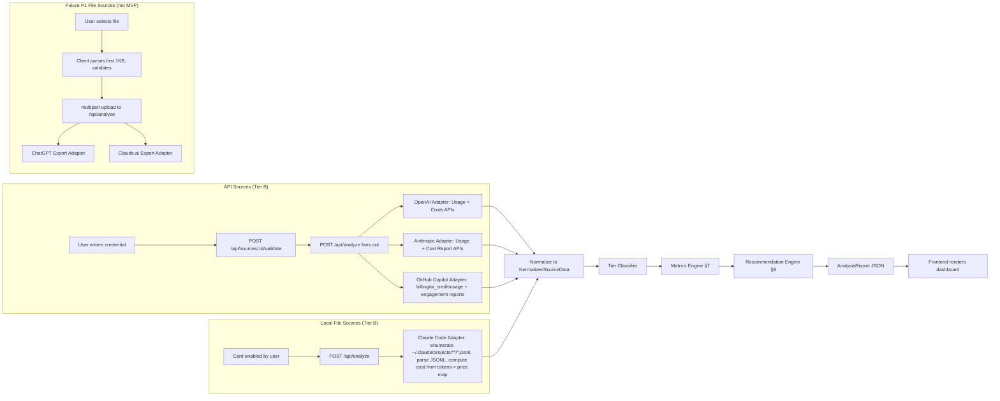

> **Reference document.** This is the amendment that describes changes from v1.0 to v1.1. The canonical current design is [`engineering-design-v1.1.md`](./engineering-design-v1.1.md).
# Promptly Engineering Design Amendment: v1.0 → v1.1

**Design version:** 1.1
**Date:** 2026-06-22
**Targets spec:** v1.6 (2026-06-22)
**Base document:** Promptly Engineering Design v1.0 (2026-06-18), written against spec v1.1
**Author:** architect agent

---

## Summary of Changes

This amendment is **targeted**: it lists only the sections that change. All other sections of the v1.0 design remain in force.

| Design section | Change driver | Nature of change |
|---|---|---|
| §1.2 Data Flow Diagram | OQ-10, v1.2 spec rewrite | Claude Code moves from "File Sources (Tier C)" to a new "Local File Sources (Tier B)" box; ChatGPT/Claude.ai export removed from P0 data flow |
| §1.3 Sequence Diagram | OQ-10, OQ-2 | GitHub Copilot parallel block updated to new billing API; Claude Code block updated from multipart parse to local filesystem read |
| §2 Project Structure | OQ-10, OQ-2, spec §8 renumber | `claudeExport.ts` → `claudeCode.ts`; recommendation files renamed R1–R4 per spec v1.6 numbering; `ClaudeExportSourceCard.tsx` → `ClaudeCodeSourceCard.tsx` |
| §3.3.3 `githubCopilot.ts` | OQ-2 (Tier C → Tier B) | Full adapter rewrite: new billing endpoints, new response schema, Tier B output |
| §3.3.5 (adapter) | OQ-10 | File renamed to `claudeCode.ts`; logic rewritten from file-upload parse to local JSONL filesystem read; Tier C → Tier B |
| §3.5 Insight Computation Module | OQ-10, OQ-2, spec §7 | Copilot metrics move from `tierC.ts` to `tierB.ts`; Claude Code metrics added; `cachedTokenFraction` extended to Claude Code |
| §3.6 Recommendation Engine | spec §8 renumber, OQ-10, OQ-2 | Rule files renamed; trigger table revised to R1–R4 spec v1.6 numbering; R1 gains 3 paths (A/B Anthropic, C Claude Code); R2 gains Copilot model substitution table; R5/R6 removed (deferred) |
| §3.7 `lookupPrice()` | OQ-1 | Approximation annotation added for OpenAI; longest-key-wins logic added |
| §4.5 Results View | OQ-2 (Tier C → Tier B) | `<CopilotPanel />` updated to render Tier B cost metrics (§7.15–7.19) |
| §5 Data Models | OQ-10, OQ-2 | `NormalizedCopilotActivity` replaced by `NormalizedCopilotBillingItem` + `NormalizedCopilotEngagement`; `NormalizedSourceData` Copilot fields updated; `SourceMetrics` Copilot fields updated; cache token comments updated |

---

## §1.2 — Data Flow Diagram

**What changed and why:** Claude Code is a local filesystem read (Tier B), not a user file upload. ChatGPT and Claude.ai exports are P1 (no longer P0). The subgraph structure must reflect this.

**Replacement for §1.2:**



---

## §1.3 — Request/Response Lifecycle Sequence Diagram

**What changed and why:** (1) The GitHub Copilot parallel block referenced the deprecated `/user/copilot/usage` endpoint (shut down April 2, 2026). Updated to the new billing API. (2) The "Claude export" parallel block described multipart parsing of a user-uploaded file; Claude Code reads from the local filesystem — no multipart upload.

**Replacement for the parallel section inside the `par` block only (lines inside `par ... end`):**

```
    par OpenAI
        ADP->>PROV: paginate /v1/organization/usage/completions
        ADP->>PROV: paginate /v1/organization/costs
    and Anthropic
        ADP->>PROV: paginate /v1/organization/usage_report/messages
        ADP->>PROV: paginate /v1/organization/cost_report
    and GitHub Copilot
        ADP->>PROV: GET /organizations/{org}/settings/billing/ai_credit/usage (org plan)<br/>or GET /users/{username}/settings/billing/ai_credit/usage (individual plan)<br/>Header: X-GitHub-Api-Version: 2026-03-10
        ADP->>PROV: GET /orgs/{org}/copilot/metrics/reports/organization-1-day (engagement NDJSON)
    and Claude Code
        Note over ADP: enumerate ~/.claude/projects/**/*.jsonl (no network call)<br/>parse JSONL per-message token counts<br/>compute cost = tokens × LiteLLM price map
    end
```

---

## §2 — Project Structure

**What changed and why:** (1) `claudeExport.ts` was a Claude.ai file-upload adapter (Tier C, P1 source). It is replaced by `claudeCode.ts` (local filesystem reader, Tier B, P0 source). (2) Recommendation files used a spec v1.1 numbering (R1–R6); spec v1.6 locks to 4 rules (R1–R4) with different content assignments. (3) `ClaudeExportSourceCard.tsx` is renamed to `ClaudeCodeSourceCard.tsx`.

**Replacement for the `adapters/` subtree and the `recommendations/` subtree in §2:**

```
        ├── adapters/
        │   ├── types.ts
        │   ├── registry.ts
        │   ├── openai.ts
        │   ├── anthropic.ts
        │   ├── githubCopilot.ts
        │   ├── claudeCode.ts              # NEW: reads ~/.claude/projects/**/*.jsonl, Tier B
        │   ├── chatgptExport.ts           # STUB: P1, not active for MVP
        │   └── claudeExport.ts            # STUB: P1 (Claude.ai web export), not active for MVP
```

```
        └── recommendations/
            ├── index.ts          # runs all rules, sorts by severity
            ├── R1_promptCaching.ts    # was R4_promptCaching.ts; now 3-path trigger
            ├── R2_modelDowngrade.ts   # was R1_modelDowngrade.ts; now includes Copilot
            ├── R3_verbosity.ts        # was R3_outputInflation.ts
            └── R4_offPeak.ts          # was R5_quotaRisk.ts placeholder; now off-peak hours
            # R2_longConversations.ts REMOVED (P1 file export trigger, deferred)
            # R5_quotaRisk.ts REMOVED (deferred per spec §8)
            # R6_copilotValue.ts REMOVED (deferred per spec §8)
```

**Source card rename in `client/src/components/Sources/`:**
```
        │   ├── Sources/
        │   │   ├── SourceGrid.tsx
        │   │   ├── SourceCard.tsx
        │   │   ├── OpenAISourceCard.tsx
        │   │   ├── AnthropicSourceCard.tsx
        │   │   ├── GitHubCopilotSourceCard.tsx
        │   │   ├── ClaudeCodeSourceCard.tsx       # was ClaudeExportSourceCard.tsx
        │   │   ├── ChatGPTExportSourceCard.tsx    # STUB: P1, visible but disabled for MVP
        │   │   └── DateRangePicker.tsx
```

---

## §3.3.3 — `githubCopilot.ts` Adapter

**What changed and why:** The v1.0 design used the deprecated `/user/copilot/usage` + `/orgs/{org}/copilot/usage` endpoints (shut down April 2, 2026) and classified the adapter as Tier C. Spec v1.3 reclassified GitHub Copilot to Tier B via the new AI credit billing API. OQ-2 is now resolved, eliminating the blocking uncertainty. This is a complete section replacement.

**Replacement for §3.3.3:**

#### 3.3.3 `githubCopilot.ts`

- **validate**: Call `GET /user` with `Authorization: token <pat>` and `X-GitHub-Api-Version: 2026-03-10`. Then probe the billing endpoint:
  - Attempt `GET /users/{username}/settings/billing/ai_credit/usage?per_page=1` (individual plan).
  - On 403/404, attempt `GET /organizations/{orgSlug}/settings/billing/ai_credit/usage?per_page=1` if `ctx.options.orgSlug` is provided.
  - If both return 403/404 → `NOT_FOUND` ("This GitHub token does not have the required permissions to access Copilot billing data.")
  - 401 → `INVALID_KEY`
  - Either 200 → `{ valid: true }`

  **Token scope required:**
  - Individual endpoint: classic PAT with `user` scope; user must have a self-purchased Copilot plan (Free/Pro/Pro+/Max).
  - Org endpoint: classic PAT with `repo` scope (recommended) or `admin:org`; caller must be org admin or billing manager.
  - Fine-grained PATs are **not** supported by these endpoints.

- **run**:

  1. **Billing data (cost-denominated, Tier B):**
     ```
     GET /organizations/{org}/settings/billing/ai_credit/usage
       ?startDate=<YYYY-MM-DD>&endDate=<YYYY-MM-DD>&per_page=100&page=<cursor>
     Header: X-GitHub-Api-Version: 2026-03-10
     ```
     For individual plans, substitute `/users/{username}/settings/billing/ai_credit/usage`.
     Paginate until exhausted. Each page returns `{ usageItems: [...] }` where each item has:
     ```typescript
     {
       product: string;         // e.g. "copilot_chat"
       sku: string;
       model: string;           // e.g. "claude-sonnet-4-6", "gpt-5.4", "gemini-3-5-flash"
       pricePerUnit: number;    // AI credits per unit
       grossQuantity: number;   // interactions billed
       grossAmount: number;     // AI credits (gross)
       discountAmount: number;  // AI credits discounted
       netAmount: number;       // AI credits net (grossAmount - discountAmount)
     }
     ```
     1 AI credit = $0.01 USD. Convert all amounts: `usd = credits * 0.01`.

  2. **Engagement metrics (acceptance rate, completion counts):**
     ```
     GET /orgs/{org}/copilot/metrics/reports/organization-1-day   → NDJSON download URL
     GET /orgs/{org}/copilot/metrics/reports/users-1-day          → NDJSON download URL
     ```
     Follow the redirect to the NDJSON file. Parse line-by-line. Fields needed per day:
     `total_suggestions_count`, `total_acceptances_count`.
     Skip if 404 (user may lack org scope; engagement data is non-blocking).

  3. **Normalize to `NormalizedSourceData`:**
     ```typescript
     {
       sourceId: 'github_copilot',
       copilotBillingItems: NormalizedCopilotBillingItem[],  // from step 1
       copilotEngagement: NormalizedCopilotEngagement[],     // from step 2 (may be empty)
       periodStart: string,
       periodEnd: string,
     }
     ```

- **Tier output**: `'B'` (actual AI credit costs per model, model attribution).
- **Error on completions endpoint 404**: Log warning `"Engagement data unavailable (org metrics endpoint returned 404). Acceptance rate will not be shown."` in `AdapterResult.warnings`. Do not fail the adapter.
- **Timeout/retry**: same policy as `openai.ts` (30s/call, 3 attempts exp. backoff, 90s soft cap).

---

## §3.3.5 — `claudeCode.ts` Adapter

**What changed and why:** The v1.0 design had `claudeExport.ts` implementing a Claude.ai web export file-upload parser (Tier C, P1). OQ-10 is now resolved: Claude Code session data is at `~/.claude/projects/<encoded-project-path>/<sessionId>.jsonl`. Cost is NOT stored in the files; it must be computed from tokens × model price. The adapter is renamed `claudeCode.ts` and completely rewritten as a local filesystem reader returning Tier B data.

**Replacement for §3.3.5:**

#### 3.3.5 `claudeCode.ts`

- **validate**: No credentials to validate. Instead, resolve the base path:
  ```typescript
  const base = process.env.CLAUDE_CONFIG_DIR
    ? path.join(process.env.CLAUDE_CONFIG_DIR, 'projects')
    : path.join(os.homedir(), '.claude', 'projects');
  ```
  Check that `base` exists and contains at least one `.jsonl` file (recursive glob `**/*.jsonl`).
  - Missing directory or zero files → `{ valid: false, error: { code: 'NOT_FOUND', message: 'No Claude Code data found. Have you run Claude Code at least once?' } }`
  - At least one file found → `{ valid: true }`

- **run**:

  1. Enumerate all `*.jsonl` files under `base` using `glob('**/*.jsonl', { cwd: base })`.
  2. For each file, read it fully and split on `\n`. Parse each non-empty line as JSON.
  3. Each JSONL line represents one turn/message event. The relevant fields per line are:
     ```typescript
     {
       type: string;             // e.g. "message"
       model?: string;           // model name (e.g. "claude-sonnet-4-6")
       usage?: {
         input_tokens: number;
         output_tokens: number;
         cache_creation_input_tokens?: number;
         cache_read_input_tokens?: number;
       };
       timestamp?: string;       // ISO timestamp
     }
     ```
     Only lines with `usage` present contribute to token counts. Lines without `usage` are skipped.
  4. For each session file, extract: `sessionId` (filename without extension), `projectDir` (parent directory name), first `timestamp` found.
  5. Aggregate by `(model, date)`:
     ```typescript
     // dailyTokensByModel keyed by (date, model)
     // date = timestamp.slice(0, 10) || sessionStartDate.slice(0, 10)
     acc[key].inputTokens += usage.input_tokens;
     acc[key].outputTokens += usage.output_tokens;
     acc[key].cacheCreationInputTokens += usage.cache_creation_input_tokens ?? 0;
     acc[key].cacheReadInputTokens += usage.cache_read_input_tokens ?? 0;
     ```
  6. Compute cost per `(model, date)` bucket:
     ```typescript
     const price = lookupPrice(ctx.priceMap, model);
     if (price) {
       costUsd =
         (inputTokens * price.input_cost_per_token) +
         (outputTokens * price.output_cost_per_token) +
         (cacheCreationInputTokens * (price.cache_creation_input_token_cost ?? price.input_cost_per_token)) +
         (cacheReadInputTokens * (price.cache_read_input_token_cost ?? 0));
     }
     ```
     If `price` is null for a model, emit a warning: `"Price unavailable for model '${model}' — cost contribution omitted."`.
  7. Normalize to `NormalizedSourceData`:
     ```typescript
     {
       sourceId: 'claude_code',
       dailyTokensByModel: NormalizedUsageRecord[],   // one entry per (date, model)
       dailyCostUsd: { date: string; costUsd: number }[],  // summed across models per day
       cachedTokensSupported: true,
       sessionCount: number,                          // total distinct session files parsed
       periodStart: string,                           // min(timestamp) across all sessions
       periodEnd: string,                             // max(timestamp)
     }
     ```

- **Tier output**: `'B'` (actual token counts + computed cost, per model, per day).
- **Malformed file handling**: If a JSONL file throws on parse, log `"Session file ${filename} could not be parsed — skipped."` in `AdapterResult.warnings`. Continue with remaining files.
- **File size cap**: No hard cap for individual session files (they are typically small). If the total data volume across all files exceeds 200 MB, emit a warning and parse only the most recent 500 session files (sorted by file mtime descending).
- **No multipart upload**: Claude Code data never passes through multipart upload or `multer`. The adapter reads directly from the filesystem within the Express server process.

---

## §3.5 — Insight Computation Module

**What changed and why:** (1) GitHub Copilot is now Tier B; its metrics move from `tierC.ts` to `tierB.ts`. (2) Claude Code metrics are added (session count, avg tokens per session). (3) `cachedTokenFraction` now covers both Anthropic and Claude Code with separate per-source outputs. The metric mapping table replaces the v1.0 version entirely.

**Replacement for the metric mapping table in §3.5:**

| Spec metric | Module | Function | Inputs | Output |
|---|---|---|---|---|
| 7.1 Total actual spend | metrics/crossSource.ts | `totalActualSpendUsd(sources)` | `NormalizedSourceData[]` + priceMap | `{ actualUsd, totalUsd }` |
| 7.2 Total tokens | metrics/crossSource.ts | `totalTokens(sources)` | sources | `{ actualTokens }` (Copilot excluded) |
| 7.3 Analysis period | metrics/crossSource.ts | `analysisPeriod(sources, req)` | sources + req | `{ start, end, perSource: {...} }` |
| 7.4 Total spend actual | metrics/tierB.ts | `totalActualSpendUsd(daily)` | `dailyCostUsd[]` | number |
| 7.5 Daily spend trend | metrics/tierB.ts | `dailySpendTrend(daily)` | `dailyCostUsd[]` | `{ date, costUsd }[]` |
| 7.6 Model cost share | metrics/tierB.ts | `modelCostShare(tokensByModel, totalActual, priceMap)` | inputs | `{ model, estimatedShare, estimatedCostUsd }[]`; result is an **estimate** for OpenAI (see note) |
| 7.7 Input/output ratio | metrics/tierB.ts | `inputOutputRatio(tokensByModel)` | inputs | `{ aggregate, perModel }` |
| 7.8 Cached fraction (Anthropic) | metrics/tierB.ts | `cachedTokenFractionAnthropic(tokensByModel)` | Anthropic `dailyTokensByModel` | `{ fraction, savingsUsd }` |
| 7.8 Cached fraction (Claude Code) | metrics/tierB.ts | `cachedTokenFractionClaudeCode(tokensByModel)` | Claude Code `dailyTokensByModel` | `{ fraction, savingsUsd }` |
| 7.9 Avg daily spend | metrics/tierB.ts | `avgDailySpend(daily)` | daily | number |
| 7.10 Peak spend day | metrics/tierB.ts | `peakSpendDay(daily)` | daily | `{ date, costUsd }` |
| 7.11 7-day rolling avg | metrics/tierB.ts | `rollingAvgSpend7d(daily)` | daily | number |
| 7.12 MoM change | metrics/tierB.ts | `momChangePct(daily)` | daily | `number \| null` (null if <45 days) |
| 7.12a Avg daily output tokens/model | metrics/tierB.ts | `avgDailyOutputTokensPerModel(tokensByModel)` | inputs | `Map<model, number>` |
| 7.13 Claude Code session count | metrics/tierB.ts | `claudeCodeSessionCount(raw)` | `NormalizedSourceData` (claude_code) | number |
| 7.14 Claude Code avg tokens/session | metrics/tierB.ts | `claudeCodeAvgTokensPerSession(raw)` | `NormalizedSourceData` (claude_code) | number |
| 7.15 Copilot total AI credit spend | metrics/tierB.ts | `copilotTotalSpend(items)` | `NormalizedCopilotBillingItem[]` | `{ grossUsd, discountUsd, netUsd }` |
| 7.16 Copilot spend by model | metrics/tierB.ts | `copilotSpendByModel(items)` | `NormalizedCopilotBillingItem[]` | `{ model, netUsd, share }[]` |
| 7.17 Copilot cost per interaction | metrics/tierB.ts | `copilotCostPerInteraction(items)` | `NormalizedCopilotBillingItem[]` | number (USD) |
| 7.18 Copilot model distribution | metrics/tierB.ts | `copilotModelDistribution(items)` | `NormalizedCopilotBillingItem[]` | `{ model, share }[]` |
| 7.19 Copilot acceptance rate | metrics/tierB.ts | `copilotAcceptanceRate(engagement)` | `NormalizedCopilotEngagement[]` | `number \| null` |

**Note on §7.6 (OpenAI model cost share):** `modelCostShare()` returns **estimated** per-model cost for OpenAI sources. The Costs API returns only daily totals; per-model cost is approximated as each model's token fraction of the daily total multiplied by the daily cost. The function must attach `estimated: true` to each entry when `sourceId === 'openai'`. The UI must render these entries with the label "Estimated model cost breakdown" (not just "Model cost breakdown").

All functions remain **pure**: same inputs → same outputs.

---

## §3.6 — Recommendation Engine

**What changed and why:** Spec v1.2 renumbered recommendations to R1–R4 with different content. OQ-10 adds a third trigger path (path C) to R1. OQ-2 (Copilot Tier B) extends R2 to fire on Copilot model spend. R5 (Quota Risk) and R6 (Copilot Value) are deferred; their stubs are removed.

### Updated `Rule` interface and `RecommendationId`

```typescript
// No interface changes; only the id type narrows:
export type RecommendationId = 'R1' | 'R2' | 'R3' | 'R4';
```

### Updated rule trigger and output mapping table

**Replacement for the rule trigger/output table in §3.6:**

| Rule | File | Trigger (spec §8) | Inputs needed | Output fields |
|---|---|---|---|---|
| R1 Prompt Caching | `R1_promptCaching.ts` | **Path A (Anthropic):** `cache_creation_input_tokens_anthropic == 0 AND total_input_tokens_anthropic > 100000`<br>**Path B (Anthropic):** `cache_fraction_anthropic < 0.1 AND total_input_tokens_anthropic > 100000`<br>**Path C (Claude Code):** `(cache_creation_input_tokens_claude_code == 0 OR cache_fraction_claude_code < 0.1) AND total_input_tokens_claude_code > 100000` | Anthropic and/or Claude Code source metrics, priceMap | `{ id, severity:'Medium', title, body, triggeringMetric, triggeringValue, estimatedSavingsUsd, sourceIds }`; **one card per triggering source** |
| R2 Model Downgrade | `R2_modelDowngrade.ts` | `model_cost_share(m) > 0.3 AND output_tokens_per_day(m) < 500 AND spend(m) > $5 AND m in DOWNGRADE_MAP` (non-Copilot)<br>OR `copilot_model_cost_share(m) > 0.3 AND total_copilot_net_usd > $5 AND m in COPILOT_DOWNGRADE_MAP` (Copilot) | All Tier B source metrics, priceMap | `{ id, severity:'High', ... }` one card per triggering model |
| R3 Reduce Verbosity | `R3_verbosity.ts` | `p90_daily_input_tokens > 50000 AND aggregate_input_output_ratio > 8` across Tier B token sources | Tier B token source metrics | `{ id, severity:'Medium', ... }` |
| R4 Off-Peak Hours | `R4_offPeak.ts` | Claude Code connected AND `>70% sessions 08:00–18:00 weekdays` AND `session_count >= 20` AND `data_window_days >= 7` | Claude Code source metrics | `{ id, severity:'Low', ... }` |

### R1 trigger implementation (`R1_promptCaching.ts`)

```typescript
// server/src/engine/recommendations/R1_promptCaching.ts

export const R1: Rule = {
  id: 'R1',
  severity: 'Medium',
  evaluate(ctx: RuleContext): RecommendationResult[] {
    const cards: RecommendationResult[] = [];

    // --- Anthropic paths A and B ---
    const ant = ctx.sources.find(s => s.sourceId === 'anthropic');
    if (ant?.totalInputTokensAnthropic && ant.totalInputTokensAnthropic > 100_000) {
      const pathA = (ant.cacheCreationInputTokensAnthropic ?? 0) === 0;
      const pathB = (ant.cachedTokenFractionAnthropic ?? 0) < 0.1;
      if (pathA || pathB) {
        cards.push(buildR1Card('anthropic', ant, ctx.priceMap));
      }
    }

    // --- Claude Code path C ---
    const cc = ctx.sources.find(s => s.sourceId === 'claude_code');
    if (cc?.totalInputTokensClaudeCode && cc.totalInputTokensClaudeCode > 100_000) {
      const noCache = (cc.cacheCreationInputTokensClaudeCode ?? 0) === 0;
      const lowCache = (cc.cachedTokenFractionClaudeCode ?? 0) < 0.1;
      if (noCache || lowCache) {
        cards.push(buildR1Card('claude_code', cc, ctx.priceMap));
      }
    }

    return cards;  // 0, 1, or 2 cards
  },
};
```

When both Anthropic and Claude Code trigger simultaneously, `evaluate()` returns **two separate cards** — one per source. Each card's `body` substitutes `[source_name]` = "Anthropic" or "Claude Code" respectively.

### R2 downgrade-candidate tables (`R2_modelDowngrade.ts`)

The non-Copilot table is unchanged from v1.0:

```typescript
const DOWNGRADE_MAP: Array<{ pattern: RegExp; cheaper: string }> = [
  { pattern: /^gpt-4o$/, cheaper: 'gpt-4o-mini' },
  { pattern: /^gpt-4-turbo/, cheaper: 'gpt-4o-mini' },
  { pattern: /^claude-3-5-sonnet/, cheaper: 'claude-3-haiku-20240307' },
  { pattern: /^claude-3-opus/, cheaper: 'claude-3-5-sonnet-20241022' },
];
```

**New Copilot substitution table** (static const in `R2_modelDowngrade.ts`):

```typescript
// Copilot trigger uses model names as returned by the billing API (snake_case).
// Pricing rationale: docs.github.com/en/copilot/reference/copilot-billing/models-and-pricing
const COPILOT_DOWNGRADE_MAP: Array<{ pattern: RegExp; cheaper: string; rationale: string }> = [
  { pattern: /^claude-opus-4/i,          cheaper: 'claude-haiku-4-5',   rationale: '10–30x cheaper; suitable for straightforward Chat queries' },
  { pattern: /^claude-sonnet-4/i,        cheaper: 'claude-haiku-4-5',   rationale: '3–5x cheaper; appropriate for most coding assistance tasks' },
  { pattern: /^gpt-5-4$|^gpt-5-5$/i,    cheaper: 'gpt-5-4-mini',       rationale: '5–20x cheaper; equivalent quality for code completion and short queries' },
  { pattern: /^gemini-3-1-pro/i,         cheaper: 'gemini-3-5-flash',   rationale: '4–8x cheaper; comparable quality for standard tasks' },
  { pattern: /^claude-fable-5/i,         cheaper: 'claude-sonnet-4-6',  rationale: 'Significant cost reduction; Fable 5 reserved for complex multi-step tasks' },
];
```

**Copilot trigger guard**: before evaluating any Copilot model entry, check `total_copilot_net_usd >= 5.00`. If total net Copilot spend is below $5.00, skip the entire Copilot branch of R2 (insufficient signal).

**Copilot pricing source for savings estimate**: use `pricePerUnit` from the billing API response (`NormalizedCopilotBillingItem.pricePerUnit`) for the detected premium model. For the cheaper alternative, use `pricePerUnit` if the user has used that model in the billing data; otherwise suppress the savings estimate for that pair.

**Copilot R2 body note**: omit "but generates an average of only [N] output tokens per day" (token counts not exposed by Copilot billing API). Replace with: "Consider switching to [cheaper model] for routine Chat and CLI interactions in Copilot settings."

---

## §3.7 — `lookupPrice()` and Price Map Integration

**What changed and why:** OQ-1 is resolved: OpenAI per-model cost is an estimate (token-fraction approximation), not exact billing data. The function must signal this. Additionally, the v1.0 `lookupPrice()` prefix-matching logic has an ordering ambiguity (design review observation #6); this is fixed with longest-key-wins logic.

**Replacement for `lookupPrice()` in §3.7:**

```typescript
export function lookupPrice(map: PriceMap, model: string): PriceEntry | null {
  // 1. Exact match (fastest path; covers versioned model IDs)
  if (map.has(model)) return map.get(model)!;

  // 2. Prefix match — longest matching key wins (prevents ambiguous overlaps
  //    between e.g. "claude-3-5-sonnet" and "claude-3-5-sonnet-20241022")
  let bestKey: string | null = null;
  let bestLen = 0;
  for (const key of map.keys()) {
    if (model.startsWith(key) || key.startsWith(model)) {
      const matchLen = Math.min(key.length, model.length);
      if (matchLen > bestLen) {
        bestLen = matchLen;
        bestKey = key;
      }
    }
  }
  return bestKey ? map.get(bestKey)! : null;
}

/**
 * Whether per-model cost figures derived from this source are estimates
 * (token-fraction approximation) rather than exact billed amounts.
 *
 * - OpenAI: true — Costs API returns daily totals only; per-model cost is
 *   estimated by multiplying each model's token share by the daily total.
 * - All other sources: false — cost is either read directly from the billing
 *   API (Anthropic, Copilot) or computed directly from tokens × price map
 *   (Claude Code).
 */
export function isModelCostEstimated(sourceId: SourceId): boolean {
  return sourceId === 'openai';
}
```

All callers that produce `ModelBreakdownEntry` objects for OpenAI sources must set `estimated: true` on each entry. The front-end renders a notice: **"Estimated model cost breakdown — exact per-model billing data is not available from the OpenAI API."**

---

## §4.5 — Results View: CopilotPanel

**What changed and why:** `<CopilotPanel />` in v1.0 rendered Tier C acceptance-rate metrics (7.20–7.24 in the old numbering). GitHub Copilot is now Tier B with cost-denominated metrics.

**Replacement for the `<CopilotPanel />` entry in §4.5:**

- **`<CopilotPanel />`** renders (in order):
  1. **§7.15** Copilot total AI credit spend: gross, discounts, and net amounts in USD (three KPI tiles). Labeled: "Covers Chat, CLI, cloud agent, and Spaces. Code completions are unlimited and not billed here."
  2. **§7.16** Copilot spend by model: table with columns `Model | Net spend (USD) | % of total`. Sorted descending by net spend.
  3. **§7.17** Copilot cost per interaction: single KPI tile. Labeled: "Average net cost per interaction (Chat, CLI, cloud agent, Spaces)."
  4. **§7.18** Copilot model distribution: `<ModelCostSharePie />` chart (reused from existing chart component, driven by Copilot billing data).
  5. **§7.19** Copilot acceptance rate (completions): displayed if engagement data is available. Prominently labeled: **"Code completions only — not billed in AI credits. Reflects coding productivity, not cost efficiency."** If engagement data is unavailable (403/404 on metrics endpoint), show inline notice: "Acceptance rate unavailable — the metrics endpoint requires org admin access."

---

## §5 — Data Models

**What changed and why:** (1) `NormalizedCopilotActivity` described code-completion metrics (Tier C). Replace with `NormalizedCopilotBillingItem` (AI credit billing, Tier B) and `NormalizedCopilotEngagement` (engagement, supplementary). (2) `NormalizedSourceData` Copilot fields updated. (3) `SourceMetrics` Copilot fields updated to Tier B. (4) Cache token comments updated to cover Claude Code.

**Replacement for the affected interfaces in §5 (full block):**

```typescript
// ====== Copilot-specific normalized shapes ======

/** One billing line item from the Copilot AI credit billing API. */
export interface NormalizedCopilotBillingItem {
  date: string;             // ISO date YYYY-MM-DD (from billing API day bucket)
  product: string;          // e.g. "copilot_chat", "copilot_cli"
  model: string;            // e.g. "claude-sonnet-4-6", "gpt-5.4", "gemini-3-5-flash"
  pricePerUnit: number;     // AI credits per interaction (from API)
  grossQuantity: number;    // interactions billed
  grossAmountUsd: number;   // grossAmount in USD (credits × 0.01)
  discountAmountUsd: number;
  netAmountUsd: number;     // netAmount in USD; use this for all cost calculations
}

/** Daily engagement metric from org/user NDJSON engagement reports. */
export interface NormalizedCopilotEngagement {
  date: string;             // ISO date YYYY-MM-DD
  suggestionsCount: number;
  acceptancesCount: number;
}

// ====== NormalizedSourceData — Copilot fields replacement ======
// (All other fields of NormalizedSourceData are unchanged from v1.0.)

export interface NormalizedSourceData {
  sourceId: SourceId;
  /** Tier B: daily token buckets per model. Present for openai, anthropic, claude_code. */
  dailyTokensByModel?: NormalizedUsageRecord[];
  /** Tier B: daily cost totals. Present for openai, anthropic, claude_code. */
  dailyCostUsd?: { date: string; costUsd: number }[];
  cachedTokensSupported?: boolean;
  /** Claude Code only: count of distinct session files parsed. */
  sessionCount?: number;
  /** Copilot Tier B: billing line items. Present for github_copilot. */
  copilotBillingItems?: NormalizedCopilotBillingItem[];
  /** Copilot Tier B: engagement data (may be empty if org metrics unavailable). */
  copilotEngagement?: NormalizedCopilotEngagement[];
  /** Derived analysis window. */
  periodStart: string;
  periodEnd: string;
}

// ====== NormalizedUsageRecord — comment update only ======

export interface NormalizedUsageRecord {
  date: string;             // ISO date YYYY-MM-DD
  model?: string;           // present for tier B
  inputTokens?: number;
  outputTokens?: number;
  cachedInputTokens?: number;               // OpenAI input_cached_tokens
  cacheCreationInputTokens?: number;        // Anthropic and Claude Code
  cacheReadInputTokens?: number;            // Anthropic and Claude Code
  costUsd?: number;                         // daily cost, independent of per-model (API sources)
                                            // or computed cost per (date, model) bucket (Claude Code)
}

// ====== SourceMetrics — Copilot fields replacement ======
// (All non-Copilot fields of SourceMetrics are unchanged from v1.0.)

export interface SourceMetrics {
  // Always present
  sourceId: SourceId;
  tier: Tier | null;
  periodStart: string;
  periodEnd: string;
  warnings: string[];

  // Tier B (OpenAI, Anthropic, Claude Code) fields — unchanged from v1.0
  totalActualSpendUsd?: number;
  dailySpend?: { date: string; spendUsd: number }[];
  modelBreakdown?: ModelBreakdownEntry[];         // estimated: true for openai
  aggregateInputOutputRatio?: number;
  // Cache fraction — now present for both Anthropic and Claude Code sources
  cachedTokenFractionAnthropic?: number;          // 7.8 (Anthropic source)
  cachedTokenSavingsUsdAnthropic?: number;
  cachedTokenFractionClaudeCode?: number;         // 7.8 (Claude Code source)
  cachedTokenSavingsUsdClaudeCode?: number;
  // The generic cachedTokenFraction / cachedTokenSavingsUsd from v1.0
  // are REPLACED by the two source-specific pairs above.
  avgDailySpendUsd?: number;
  peakSpendDay?: { date: string; spendUsd: number };
  rollingAvgSpend7dUsd?: number;
  momChangePct?: number | null;

  // Claude Code Tier B fields (NEW)
  claudeCodeSessionCount?: number;                // 7.13
  claudeCodeAvgTokensPerSession?: number;         // 7.14
  totalInputTokensClaudeCode?: number;            // used by R1 trigger
  cacheCreationInputTokensClaudeCode?: number;    // used by R1 trigger

  // Anthropic additional fields (used by R1 trigger — previously implicit)
  totalInputTokensAnthropic?: number;
  cacheCreationInputTokensAnthropic?: number;

  // GitHub Copilot Tier B fields (REPLACES old Tier C Copilot fields)
  copilotGrossSpendUsd?: number;                  // 7.15
  copilotDiscountUsd?: number;                    // 7.15
  copilotNetSpendUsd?: number;                    // 7.15
  copilotSpendByModel?: {                         // 7.16
    model: string;
    netSpendUsd: number;
    spendShare: number;
  }[];
  copilotCostPerInteractionUsd?: number;          // 7.17
  copilotModelDistribution?: {                    // 7.18
    model: string;
    share: number;
  }[];
  copilotAcceptanceRate?: number | null;          // 7.19 (null if engagement data unavailable)
  copilotTotalSuggestions?: number;
  copilotTotalAcceptances?: number;

  // REMOVED from v1.0 (were Tier C Copilot fields, no longer applicable):
  // copilotLinesAccepted, copilotEstimatedOutputTokens,
  // copilotCostPerAcceptedSuggestionUsd, copilotVsApiComparison
  // subscriptionPlanMonthlyUsd (no longer needed; actual billing available)
}
```

**JSON export schema update (§10 `sources[].metrics` example for `github_copilot`):**

```json
{
  "source_id": "github_copilot",
  "adapter": "github_copilot.js",
  "tier": "B",
  "connected": true,
  "error": null,
  "metrics": {
    "total_gross_spend_usd": 12.40,
    "total_discount_usd": 0.60,
    "total_net_spend_usd": 11.80,
    "model_breakdown": [
      { "model": "claude-sonnet-4-6", "net_spend_usd": 7.10, "spend_share": 0.60, "gross_quantity": 710 }
    ],
    "cost_per_interaction_usd": 0.0166,
    "acceptance_rate": 0.34,
    "total_suggestions": 4200,
    "total_acceptances": 1428
  }
}
```

---

## Non-Blocking Observations from Design Review (v1.0)

The design review (2026-06-19) raised six non-blocking observations. This amendment addresses some of them:

| Observation | Status after this amendment |
|---|---|
| **#1 Zero-data tier classification ambiguity.** `classifyTier()` returns `null` when data arrays are empty; `AdapterResult.tier: null` + `error: null` triggers ambiguous zero-data case not explicitly handled in the panel render path. | **Open.** Not addressed by spec changes. Developer must implement the zero-data branch: when `tier` is non-null but all metric values are zero/empty, render "$0.00 summary" per spec §6, not blank. |
| **#2 `allSourcesFailed` frontend handling not explicit.** `useAnalysis.ts` lacks an explicit branch for `allSourcesFailed: true` (spec §4: return to connection step when zero sources succeed). | **Open.** Not addressed by spec changes. Developer must add the branch. |
| **#3 OQ-1 and OQ-2 stakeholder-unresolved.** Both were [BLOCKING] open questions. | **Resolved.** OQ-1 resolved in §3.7 (OpenAI approximation note + `isModelCostEstimated()`). OQ-2 resolved in §3.3.3 (correct PAT scopes, correct endpoints). |
| **#4 Recommendation card chart thumbnails have no concrete rendering design.** `supportingChartRef` carries a `sourceId + chartId` reference but no chart registry or thumbnail-rendering pattern is designed. | **Open.** Not addressed by spec changes. Developer must invent the wiring (chart registry keyed by `sourceId:chartId`). |
| **#5 `serializeReport.ts` camelCase→snake_case boundary is mentioned but undesigned.** | **Open.** Not addressed. Small surface area; implementable from the TypeScript interfaces. |
| **#6 `lookupPrice()` prefix matching is order-dependent.** Two model keys where one is a prefix of the other could match ambiguously. | **Resolved.** §3.7 now includes longest-key-wins logic. |

---

## Unchanged Sections

The following sections of the v1.0 engineering design are **unchanged** and remain in force:

- §1.1 Component Diagram
- §1.4 Stateless Server Pattern
- §3.1 API Routes (`/api/health`, `/api/price-map/meta`, `/api/sources/:id/validate`, `/api/analyze`)
- §3.2 Source Adapter Interface (`SourceAdapter`, `AdapterContext`, `AdapterResult`, `AdapterError`)
- §3.3.1 `openai.ts` (validate/run logic unchanged; only `lookupPrice()` and per-model cost annotation updated, covered in §3.7 above)
- §3.3.2 `anthropic.ts`
- §3.3.4 `chatgptExport.ts` (P1 stub; unchanged)
- §3.4 Tier Classification Engine
- §3.8 Error Handling and Timeout Policy
- §3.9 Key and Credential Handling
- §4.1 Page / Component Hierarchy
- §4.2 State Management
- §4.3 Onboarding (Source Connection) Flow
- §4.4 Analysis Loading State
- §4.6 Charts
- §4.7 Export Trigger
- §4.8 No Auth, No Routing Complexity
- §5 Data Models: `SourceId`, `Tier`, `SourceConfig`, `AnalysisRequest`, `TierClassification`, `ModelBreakdownEntry` (except `estimated` field added, see §3.5 note), `SourceReport`, `InsightResult`, `RecommendationResult`, `AnalysisReportMetadata`, `AnalysisReport`, `CrossSourceSummary`
- §6 Architectural Decisions (ADRs)
- §7 Build and Run
- §8 Open Items for Developer
- §9 Spec Ambiguities Flagged (now fully resolved per spec v1.6)
- §10 Export Spec (PDF structure unchanged; JSON schema updated only for Copilot metrics block, covered above)
- §11 Tech Stack and Architecture Overview (stack decisions unchanged)
- §12 Out of Scope for MVP
- §13 Open Questions

---

*Ready for design-review agent.*
