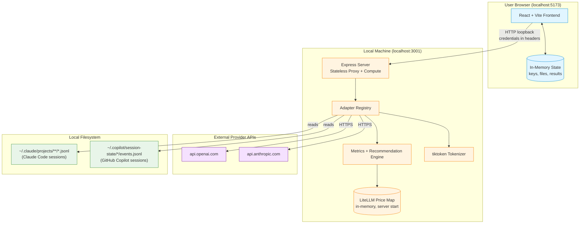
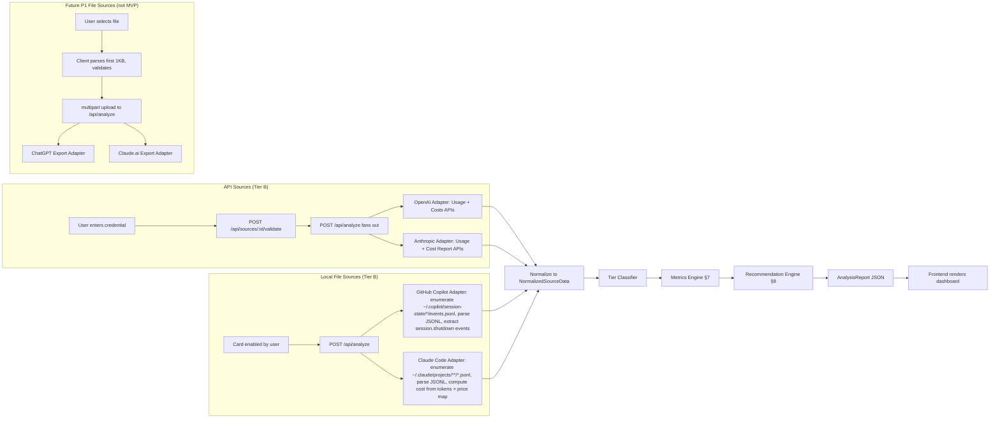
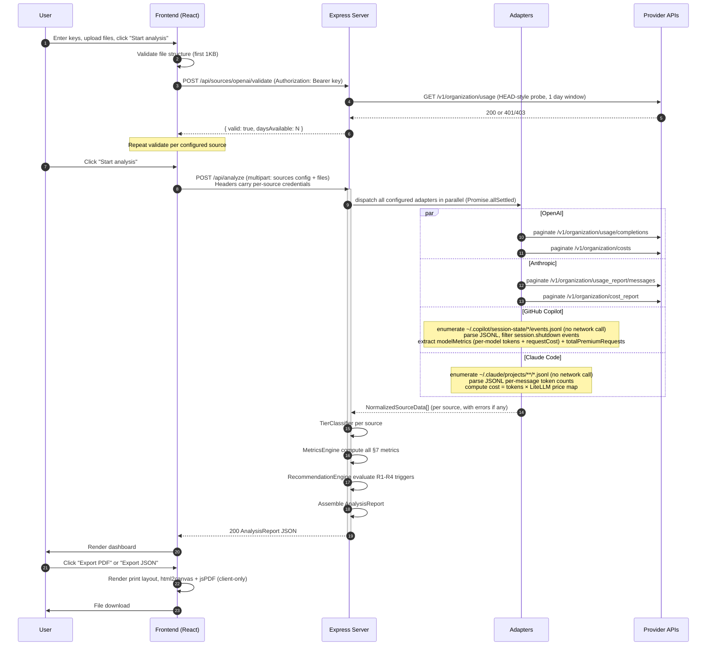
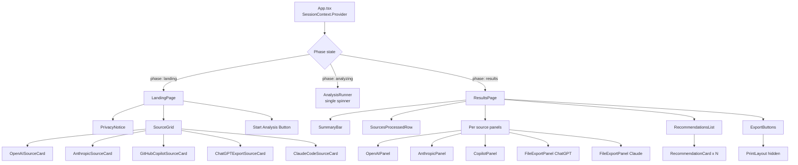
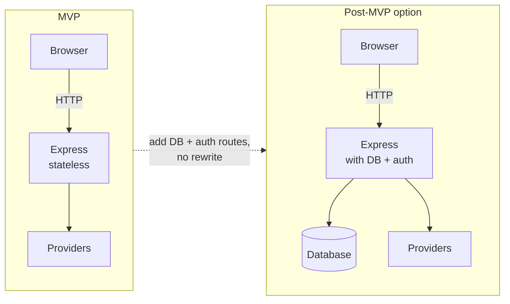

# Promptly Engineering Design v1.2

**Version:** 1.2
**Date:** 2026-06-25
**Author:** architect agent
**Source spec:** spec.md v1.8 (2026-07-01) — §6/§7 alignment pass applied 2026-07-03
**Status:** Canonical (current)
**Supersedes:** v1.0 (2026-06-18)

> **Note:** Design Amendment v1.2 (GitHub Copilot adapter: credential-based API → local JSONL file) has been merged into this document. The amendment source document is [`engineering-design-amendment-v1.2.md`](./engineering-design-amendment-v1.2.md) (retained as historical reference).

---

## Table of Contents

1. System Architecture
2. Project Structure
3. Backend Design (Node + Express)
4. Frontend Design (React + Vite)
5. Data Models (TypeScript Interfaces)
6. Architectural Decisions (ADRs)
7. Build and Run
8. Open Items for Developer
9. Spec Ambiguities Flagged
10. Design Review Notes

---

## 1. System Architecture

### 1.1 Component Diagram



### 1.2 Data Flow per Source



### 1.3 Request/Response Lifecycle for a Full Analysis



### 1.4 Stateless Server Pattern

The Express server holds **zero per-session state**. All "session" data (credentials, uploaded file bytes, computed results) lives in the React frontend memory only. Each backend request is self-contained:

- **Credentials**: passed as HTTP headers on every request, never retained past the request handler stack frame.
- **Files**: streamed through multer's memory storage (`multer.memoryStorage()`), parsed in the same request, GC'd when the handler returns.
- **Results**: returned in the response body; the server never writes them anywhere.
- **Only persistent server state**: the LiteLLM price map loaded once at server start (read-only, identical for all users). This is shared application config, not user data.

Restarting the Express process loses nothing user-related. There is no database, no session store, no log of bodies. This satisfies G6 (no retention) and §9 (privacy guarantees).

---

## 2. Project Structure

```
promptly/
├── package.json                      # root: npm workspaces, scripts: start, dev, build, lint
├── README.md                         # clone-and-run instructions
├── LICENSE
├── .gitignore
├── .nvmrc                            # node 20.x pinned
├── .env.example                      # documents optional VITE_PORT, EXPRESS_PORT
│
├── client/                           # React + Vite frontend
│   ├── package.json
│   ├── vite.config.ts
│   ├── tsconfig.json
│   ├── tailwind.config.ts
│   ├── postcss.config.js
│   ├── index.html
│   └── src/
│       ├── main.tsx                  # app entry, mounts <App />
│       ├── App.tsx                   # top-level component, holds session state via context
│       ├── context/
│       │   └── SessionContext.tsx    # React context: credentials, files, analysis result
│       ├── api/
│       │   └── client.ts             # fetch wrapper, sends credentials as headers
│       ├── components/
│       │   ├── Landing/
│       │   │   ├── LandingPage.tsx
│       │   │   └── PrivacyNotice.tsx
│       │   ├── Sources/
│       │   │   ├── SourceGrid.tsx
│       │   │   ├── SourceCard.tsx
│       │   │   ├── OpenAISourceCard.tsx
│       │   │   ├── AnthropicSourceCard.tsx
│       │   │   ├── GitHubCopilotSourceCard.tsx
│       │   │   ├── ClaudeCodeSourceCard.tsx       # was ClaudeExportSourceCard.tsx
│       │   │   ├── ChatGPTExportSourceCard.tsx    # STUB: P1, visible but disabled for MVP
│       │   │   └── DateRangePicker.tsx
│       │   ├── Analysis/
│       │   │   ├── AnalysisRunner.tsx          # the "Analyzing your data" loader
│       │   │   └── useAnalysis.ts              # hook: kicks off POST /api/analyze
│       │   ├── Results/
│       │   │   ├── ResultsPage.tsx
│       │   │   ├── SummaryBar.tsx
│       │   │   ├── SourcesProcessedRow.tsx
│       │   │   ├── SourcePanel.tsx             # generic shell per source
│       │   │   ├── panels/
│       │   │   │   ├── OpenAIPanel.tsx
│       │   │   │   ├── AnthropicPanel.tsx
│       │   │   │   ├── CopilotPanel.tsx
│       │   │   │   ├── FileExportPanel.tsx     # used for both ChatGPT and Claude
│       │   │   │   └── UpgradeNudge.tsx
│       │   │   ├── charts/
│       │   │   │   ├── DailySpendLine.tsx
│       │   │   │   ├── ModelCostSharePie.tsx
│       │   │   │   ├── ConversationLengthBar.tsx
│       │   │   │   └── TokenRatioBar.tsx
│       │   │   └── Recommendations/
│       │   │       ├── RecommendationsList.tsx
│       │   │       └── RecommendationCard.tsx
│       │   ├── Export/
│       │   │   ├── ExportButtons.tsx
│       │   │   ├── PrintLayout.tsx             # hidden until print, structured for PDF
│       │   │   └── exportJson.ts
│       │   └── common/
│       │       ├── Button.tsx
│       │       ├── Spinner.tsx
│       │       ├── ErrorBanner.tsx
│       │       └── TierBadge.tsx
│       ├── types/
│       │   └── index.ts                        # shared TS interfaces (mirrors server)
│       └── utils/
│           ├── formatCurrency.ts
│           └── formatTokens.ts
│
├── server/                           # Node + Express backend
│   ├── package.json
│   ├── tsconfig.json
│   └── src/
│       ├── index.ts                  # boots Express, loads price map, registers routes
│       ├── app.ts                    # Express app factory (separated for testability)
│       ├── routes/
│       │   ├── health.ts             # GET /api/health
│       │   ├── priceMap.ts           # GET /api/price-map/meta
│       │   ├── validate.ts           # POST /api/sources/:id/validate
│       │   └── analyze.ts            # POST /api/analyze
│       ├── adapters/
│       │   ├── types.ts
│       │   ├── registry.ts
│       │   ├── openai.ts
│       │   ├── anthropic.ts
│       │   ├── githubCopilot.ts
│       │   ├── claudeCode.ts              # reads ~/.claude/projects/**/*.jsonl, Tier B
│       │   ├── chatgptExport.ts           # STUB: P1, not active for MVP
│       │   └── claudeExport.ts            # STUB: P1 (Claude.ai web export), not active for MVP
│       ├── engine/
│       │   ├── tiers.ts              # classifyTier(normalized) → 'B' | 'C' | null
│       │   ├── metrics/
│       │   │   ├── index.ts          # orchestrator: per-source metric computation
│   │   │   ├── tierB.ts          # §7.4–§7.17 per spec v1.8 (OpenAI/Anthropic/Copilot/ClaudeCode)
│       │   │   ├── tierC.ts          # file export metrics (P1 stubs)
│       │   │   ├── crossSource.ts    # 7.1 - 7.3
│       │   │   └── pricing.ts        # LiteLLM lookups, blended price helpers
│       │   └── recommendations/
│       │       ├── index.ts          # runs all rules, sorts by severity
│       │       ├── R1_promptCaching.ts    # 3-path trigger (Anthropic A/B, Claude Code C)
│       │       ├── R2_modelDowngrade.ts   # includes Copilot model substitution
│       │       ├── R3_verbosity.ts        # output inflation check
│       │       └── R4_offPeak.ts          # off-peak hours trigger (Claude Code)
│       ├── data/
│       │   ├── priceMap.ts           # loader: fetch + fallback, cache in memory
│       │   └── snapshot/
│       │       └── model_prices_and_context_window.json  # bundled fallback
│       ├── lib/
│       │   ├── tokenizer.ts          # tiktoken singleton, cl100k_base
│       │   ├── httpClient.ts         # fetch wrapper with retry + timeout
│       │   └── errors.ts             # AdapterError, ValidationError taxonomy
│       ├── middleware/
│       │   ├── credentialHeader.ts   # extracts per-source credentials
│       │   ├── errorHandler.ts
│       │   └── safeLogger.ts         # logs method/path/status only, no bodies
│       └── types/
│           └── index.ts              # shared TS interfaces (mirrors client)
│
└── shared/                           # OPTIONAL: only if both packages adopt project refs
    └── types.ts                      # AnalysisReport, NormalizedUsageRecord, etc.
```

**Notes on structure:**
- npm workspaces: root `package.json` declares `"workspaces": ["client", "server"]`. A single `npm install` at root installs both.
- TypeScript on both sides (the spec implies JS but TS is recommended for type safety on the contract between layers; flagged as developer-confirmable).
- `shared/` is optional. The simpler path is to duplicate the type definitions in `client/src/types/index.ts` and `server/src/types/index.ts` and keep them in sync manually (small surface, MVP). Use a shared package only if the developer prefers project references.

---

## 3. Backend Design (Node + Express)

### 3.1 API Routes

All routes are prefixed `/api`. CORS is locked to `http://localhost:5173` (Vite default) plus whatever `VITE_PORT` is set to.

#### `GET /api/health`

Trivial liveness check.

**Response 200:**
```json
{ "status": "ok", "uptimeSeconds": 123 }
```

#### `GET /api/price-map/meta`

Returns metadata about the LiteLLM price map currently loaded. Used for the "Assumptions and Caveats" PDF page.

**Response 200:**
```json
{
  "loadedAt": "2026-06-18T19:30:00Z",
  "sourceDate": "2026-06-17",
  "source": "github-fetch" | "bundled-snapshot",
  "modelCount": 412
}
```

#### `POST /api/sources/:sourceId/validate`

Lightweight credential check before kicking off full analysis. `:sourceId` is one of `openai | anthropic | github_copilot`. For API sources (`openai`, `anthropic`) this requires an `X-Source-Credential` header. For `github_copilot`, no credential header is required — the server performs a filesystem probe of `~/.copilot/session-state/`. (Claude Code is validated the same way; its sourceId is not routed through this endpoint but uses the same pattern.)

**Headers:**
- `X-Source-Credential`: the API key or token (raw value)

**Request body (JSON):**
```json
{
  "startDate": "2026-05-19",
  "endDate": "2026-06-18"
}
```

**Response 200:**
```json
{
  "valid": true,
  "sourceId": "openai",
  "daysAvailable": 30,
  "warnings": []
}
```

**Response 4xx:**
```json
{
  "valid": false,
  "sourceId": "openai",
  "errorCode": "MISSING_ADMIN_SCOPE" | "INVALID_KEY" | "NETWORK_ERROR" | "FORBIDDEN" | "RATE_LIMITED",
  "errorMessage": "This key does not have Admin permissions. Org-level admin keys are required for usage data."
}
```

#### `POST /api/analyze`

The main workhorse. Accepts a multipart form with:
- Field `config` (JSON string): the `AnalysisRequest` object (see §5 below). Lists configured sources, date ranges, and per-source options.
- Files (optional): `chatgpt_export` and/or `claude_export` as multipart file parts.

**Headers (one per configured API source):**
- `X-Credential-OpenAI`: `<openai admin key>` (if OpenAI configured)
- `X-Credential-Anthropic`: `<anthropic admin key>` (if Anthropic configured)

GitHub Copilot and Claude Code do not send credential headers — they are local-file sources and require no authentication.

**Why headers, not body**: keys are scoped to the request and easy to scrub from any future logging without touching body parsing.

**Response 200**: full `AnalysisReport` JSON (see §5 and spec §10).

**Response 4xx/5xx**: only fired if the request itself is malformed (e.g., no sources configured at all, file too large). Per-source failures are reported inside the 200 response in `sources[i].error`, not as HTTP errors. The spec's §4 Step 6 error semantic is: don't fail the session when individual sources fail.

**Special case**: if **all** sources fail, response is still 200 with the report carrying all errors, plus a top-level `cross_source_summary.allSourcesFailed: true`. The frontend decides whether to render an error page or partial results.

### 3.2 Source Adapter Interface

The interface formalises the spec's §11 adapter contract with strict TypeScript types.

```typescript
// server/src/adapters/types.ts

export type SourceId =
  | 'openai'
  | 'anthropic'
  | 'github_copilot'
  | 'chatgpt_export'
  | 'claude_export';

export type Tier = 'A' | 'B' | 'C';

export interface AdapterContext {
  credential?: string;                  // API key or token (absent for file sources)
  startDate?: Date;                     // present for API sources
  endDate?: Date;
  fileBuffer?: Buffer;                  // present for file sources
  options?: Record<string, unknown>;    // adapter-specific
  priceMap: PriceMap;                   // injected, read-only
  tokenizer: Tokenizer;                 // injected, read-only (tiktoken instance)
  abortSignal?: AbortSignal;            // for timeout cancellation
}

export interface AdapterResult {
  sourceId: SourceId;
  tier: Tier | null;                    // null only when error is non-null
  connected: boolean;
  error: AdapterError | null;
  raw: NormalizedSourceData | null;     // null when error is non-null
  warnings: string[];                   // non-fatal advisories surfaced in UI
}

export interface AdapterError {
  code:
    | 'INVALID_KEY'
    | 'MISSING_SCOPE'
    | 'FORBIDDEN'
    | 'NOT_FOUND'
    | 'RATE_LIMITED'
    | 'NETWORK_ERROR'
    | 'TIMEOUT'
    | 'PARSE_ERROR'
    | 'FILE_TOO_LARGE'
    | 'UNKNOWN';
  message: string;                      // user-facing
  retriable: boolean;
}

export interface SourceAdapter {
  id: SourceId;

  /** Lightweight credential probe. Returns whether ctx is usable. */
  validate(ctx: AdapterContext): Promise<{
    valid: boolean;
    error: AdapterError | null;
    daysAvailable?: number;
  }>;

  /** Full data fetch + normalization. Always resolves; errors are in the result. */
  run(ctx: AdapterContext): Promise<AdapterResult>;
}
```

The registry maps `SourceId` → `SourceAdapter` so the orchestrator can iterate generically.

**Adding a new provider** (post-MVP) requires only: implement a new `SourceAdapter`, register it in `adapters/registry.ts`, add a card component in `client/src/components/Sources/`. Metrics engine and recommendation engine remain unchanged unless the new source provides new metric shapes.

### 3.3 Concrete Adapter Designs

#### 3.3.1 `openai.ts`

- **validate**: `GET /v1/organization/usage/completions?start_time={now-1day}&end_time={now}&limit=1`. Inspect status:
  - 200 → `{ valid: true, daysAvailable: computed from response date range }`
  - 401 → `INVALID_KEY`
  - 403 → `MISSING_SCOPE` (most common: non-admin key)
- **run**:
  1. Paginate `GET /v1/organization/usage/completions?start_time=<startEpoch>&end_time=<endEpoch>&bucket_width=1d&group_by[]=model&limit=180&page=<cursor>` until `has_more=false`. Each response contains buckets of `{ start_time, end_time, results: [{ model, input_tokens, output_tokens, input_cached_tokens, ... }] }`.
  2. Paginate `GET /v1/organization/costs?start_time=<startEpoch>&end_time=<endEpoch>&bucket_width=1d&page=<cursor>` until exhausted.
  3. Normalize to `NormalizedSourceData`:
     - `dailyTokensByModel: { date, model, inputTokens, outputTokens, cachedInputTokens }[]`
     - `dailyCostUsd: { date, costUsd }[]`
     - `cachedTokensSupported: true` (OpenAI exposes `input_cached_tokens` but not `cache_read` / `cache_creation` split; treat similarly to Anthropic's cache_read for the cached fraction calc).
- **Tier output**: `'B'` (tokens + cost + daily buckets).
- **Timeout/retry**: each HTTPS call wrapped in `httpClient.ts` with 30s per-call timeout, 3 attempts on 5xx/429 with exponential backoff (1s, 2s, 4s). Overall adapter aborts at 90s soft cap (returns partial-with-warning if any page succeeded, or `TIMEOUT` error if zero data).

#### 3.3.2 `anthropic.ts`

- **validate**: `GET /v1/organization/usage_report/messages?starting_at={now-1day}&ending_at={now}&limit=1`. Headers: `x-api-key: <key>`, `anthropic-version: 2023-06-01`.
  - 200 → valid
  - 401/403 → `INVALID_KEY` or `MISSING_SCOPE`
- **run**:
  1. Paginate `GET /v1/organization/usage_report/messages?starting_at=<iso>&ending_at=<iso>&granularity=daily&group_by[]=model&page=<cursor>`.
  2. Paginate `GET /v1/organization/cost_report?starting_at=<iso>&ending_at=<iso>&granularity=daily&page=<cursor>`.
  3. Normalize:
     - `dailyTokensByModel: { date, model, inputTokens, outputTokens, cacheCreationInputTokens, cacheReadInputTokens }[]`
     - `dailyCostUsd: { date, costUsd }[]`
     - `cachedTokensSupported: true` (use the explicit cache_read / cache_creation fields).
- **Tier output**: `'B'`.


#### 3.3.3 `githubCopilot.ts`

The following interfaces are **adapter-private** — defined inside `githubCopilot.ts` and not exported:

```typescript
interface CopilotModelMetrics {
  requests: { count: number; cost: number };   // cost = AI credit units (USD float)
  usage: {
    inputTokens: number;       // TOTAL prompt tokens; cacheReadTokens/cacheWriteTokens are subsets
    outputTokens: number;      // TOTAL completion tokens; reasoningTokens is a subset
    cacheReadTokens: number;
    cacheWriteTokens: number;
    reasoningTokens: number;
  };
}

interface CopilotShutdownEvent {
  type: 'session.shutdown';
  sessionStartTime: number;                          // Unix ms timestamp
  modelMetrics?: Record<string, CopilotModelMetrics>;
  totalPremiumRequests: number;                      // float AI credit cost (cross-check)
}
```

- **validate**: Filesystem probe — no network call, no credentials required.
  ```
  root = path.join(os.homedir(), '.copilot', 'session-state')
  ```
  - If `root` does not exist (`fs.access` throws): `{ valid: false, error: { code: 'NOT_FOUND', message: 'No Copilot session data found. Have you run GitHub Copilot at least once?' } }`
  - Otherwise: `{ valid: true }`

- **run**:

  **Phase 1:** Discover session directories.
  ```
  subdirs = fs.readdirSync(SESSION_STATE_ROOT, { withFileTypes: true })
              .filter(d => d.isDirectory())
  ```
  If empty, return `{ copilotSessions: [] }`.

  **Phase 2:** Read and parse each `events.jsonl`.
  For each subdir, read `<subdir>/events.jsonl`. Skip if the file does not exist. For each line, parse JSON and filter for `event.type === 'session.shutdown'`. Skip events whose `sessionStartTime` falls outside the analysis window. For qualifying events, call `buildNormalizedSession(event, toLocalDateString(event.sessionStartTime), filePath)`. Parse errors on individual lines are caught; malformed files are accumulated in `malformedFiles[]` (deduplicated — one entry per file).

  **Phase 3:** Emit warning if any files could not be fully parsed:
  `"One or more Copilot session files could not be fully parsed. Sessions with malformed events are skipped; all valid session.shutdown events are still included."`

  **Phase 4:** If `sessions` is empty but `subdirs` were found, emit warning:
  `"No Copilot session data found for the selected period. Try a wider date range."`

  **Phase 5:** Return `{ data: { copilotSessions }, metadata: { sessionCount, totalCost, dateRange } }`.

  **`buildNormalizedSession(event, date, filePath)`:** If `event.modelMetrics` is absent or empty, return `{ date, sourceFile: filePath, models: {}, totalCost: event.totalPremiumRequests ?? 0 }`. Otherwise, build the `models` map from each `[modelName, metrics]` entry in `modelMetrics`:
  ```typescript
  models[modelName] = {
    requestCount: metrics.requests.count,
    requestCost:  metrics.requests.cost,
    inputTokens:       metrics.usage.inputTokens,
    outputTokens:      metrics.usage.outputTokens,
    cacheReadTokens:   metrics.usage.cacheReadTokens,
    cacheWriteTokens:  metrics.usage.cacheWriteTokens,
    reasoningTokens:   metrics.usage.reasoningTokens,
  };
  ```
  Returns `{ date, sourceFile: filePath, models, totalCost: event.totalPremiumRequests ?? 0 }`.

- **Normalized output** (`NormalizedSourceData`):
  ```typescript
  {
    sourceId: 'github_copilot',
    copilotSessions: NormalizedCopilotSession[],   // one entry per qualifying session.shutdown event
    periodStart: string,
    periodEnd: string,
  }
  ```

- **Tier output**: `'B'` (token counts + premium request costs per model, per session).
- **Timeout/retry**: N/A — local filesystem reads; no network calls.

#### 3.3.4 `chatgptExport.ts`

- **validate**: not called (client-side validates file structure).
- **run**:
  1. `JSON.parse(buffer.toString('utf-8'))` → expect an array.
  2. For each conversation:
     - Extract messages by walking `mapping` (it's a tree; walk node by node).
     - Filter to `message.author.role in {'user', 'assistant'}`.
     - Concatenate string parts of `message.content.parts` (skip non-string parts; note count).
     - `tokens = tokenizer.encode(text).length` (cl100k_base).
  3. Aggregate per-conversation, then totals.
  4. Track `multimodal_parts_skipped_count` warning.
  5. Date range = min(`create_time`) to max(`update_time`).
- **Tier output**: `'C'`.
- **File size cap**: 50 MB, enforced by multer config.
- **Streaming consideration**: for MVP, full-file `JSON.parse` is acceptable up to 50 MB. If a future spec needs larger files, swap to `stream-json`.

#### 3.3.5 `claudeCode.ts`

- **validate**: No credentials to validate. Instead, resolve the base path:
  ```typescript
  const base = process.env.CLAUDE_CONFIG_DIR
    ? path.join(process.env.CLAUDE_CONFIG_DIR, 'projects')
    : path.join(os.homedir(), '.claude', 'projects');
  ```
  Check that `base` exists and contains at least one `.jsonl` file (recursive glob `**/*.jsonl`).
  - Missing directory or zero files → `{ valid: false, error: { code: 'NOT_FOUND', message: 'No Claude Code data found. Have you run Claude Code at least once?' } }`
  - At least one file found → `{ valid: true }`

- **run**:

  1. Enumerate all `*.jsonl` files under `base` using `glob('**/*.jsonl', { cwd: base })`.
  2. For each file, read it fully and split on `\n`. Parse each non-empty line as JSON.
  3. Each JSONL line represents one turn/message event. The relevant fields per line are:
     ```typescript
     {
       type: string;             // e.g. "message"
       model?: string;           // model name (e.g. "claude-sonnet-4-6")
       usage?: {
         input_tokens: number;
         output_tokens: number;
         cache_creation_input_tokens?: number;
         cache_read_input_tokens?: number;
       };
       timestamp?: string;       // ISO timestamp
     }
     ```
     Only lines with `usage` present contribute to token counts. Lines without `usage` are skipped.
  4. For each session file, extract: `sessionId` (filename without extension), `projectDir` (parent directory name), and the first `timestamp` found in the file. **Retain the per-session first timestamp in a separate list `sessionFirstTimestamps: string[]` (one entry per session file that yielded at least one timestamp-bearing line). Sessions with no timestamp-bearing lines are counted in `sessionCount` but excluded from `sessionFirstTimestamps`.**

  4a. **Compute `claudeCodePeakHourFraction`** from `sessionFirstTimestamps`:

  ```typescript
  /**
   * "Peak hour" = 08:00–18:00 Mon–Fri, evaluated in the local timezone offset
   * carried by the ISO timestamp (e.g. "2026-06-15T09:23:11-07:00").
   * If the timestamp has no offset (bare UTC "Z" or no suffix), treat as UTC.
   */
  function isPeakHour(isoTimestamp: string): boolean {
    const d = new Date(isoTimestamp);
    // Extract the UTC offset from the raw string (e.g. "-07:00" → -420 min)
    const offsetMatch = isoTimestamp.match(/([+-])(\d{2}):(\d{2})$/);
    const offsetMinutes = offsetMatch
      ? (offsetMatch[1] === '+' ? 1 : -1) *
        (parseInt(offsetMatch[2], 10) * 60 + parseInt(offsetMatch[3], 10))
      : 0;  // UTC
    // Shift UTC epoch to local time
    const localMs = d.getTime() + offsetMinutes * 60_000;
    const local = new Date(localMs);
    const dow = local.getUTCDay();    // 0=Sun, 1=Mon … 5=Fri, 6=Sat
    const hour = local.getUTCHours(); // 0–23 in local time
    return dow >= 1 && dow <= 5 && hour >= 8 && hour < 18;
  }

  const withTimestamp = sessionFirstTimestamps.length;
  const peakCount = sessionFirstTimestamps.filter(isPeakHour).length;
  const claudeCodePeakHourFraction: number | null =
    withTimestamp > 0 ? peakCount / withTimestamp : null;
  ```

  If `claudeCodePeakHourFraction` is `null` (no sessions have timestamps), omit the field from the normalized output. R4 will treat `null` as not satisfying the trigger.

  5. Aggregate by `(model, date)`:
     ```typescript
     // dailyTokensByModel keyed by (date, model)
     // date = timestamp.slice(0, 10) || sessionStartDate.slice(0, 10)
     acc[key].inputTokens += usage.input_tokens;
     acc[key].outputTokens += usage.output_tokens;
     acc[key].cacheCreationInputTokens += usage.cache_creation_input_tokens ?? 0;
     acc[key].cacheReadInputTokens += usage.cache_read_input_tokens ?? 0;
     ```
  6. Compute cost per `(model, date)` bucket:
     ```typescript
     const price = lookupPrice(ctx.priceMap, model);
     if (price) {
       costUsd =
         (inputTokens * price.input_cost_per_token) +
         (outputTokens * price.output_cost_per_token) +
         (cacheCreationInputTokens * (price.cache_creation_input_token_cost ?? price.input_cost_per_token)) +
         (cacheReadInputTokens * (price.cache_read_input_token_cost ?? 0));
     }
     ```
     If `price` is null for a model, emit a warning: `"Price unavailable for model '${model}' — cost contribution omitted."`.
  7. Normalize to `NormalizedSourceData`:
     ```typescript
     {
       sourceId: 'claude_code',
       dailyTokensByModel: NormalizedUsageRecord[],   // one entry per (date, model)
       dailyCostUsd: { date: string; costUsd: number }[],  // summed across models per day
       cachedTokensSupported: true,
       sessionCount: number,                          // total distinct session files parsed
       claudeCodePeakHourFraction: number | undefined,// fraction in [0,1]; undefined if no timestamps
       periodStart: string,                           // min(timestamp) across all sessions
       periodEnd: string,                             // max(timestamp)
     }
     ```

- **Tier output**: `'B'` (actual token counts + computed cost, per model, per day).
- **Malformed file handling**: If a JSONL file throws on parse, log `"Session file ${filename} could not be parsed — skipped."` in `AdapterResult.warnings`. Continue with remaining files.
- **File size cap**: No hard cap for individual session files (they are typically small). If the total data volume across all files exceeds 200 MB, emit a warning and parse only the most recent 500 session files (sorted by file mtime descending).
- **No multipart upload**: Claude Code data never passes through multipart upload or `multer`. The adapter reads directly from the filesystem within the Express server process.

### 3.4 Tier Classification Engine

> **MVP scope:** All four P0 MVP adapters (OpenAI, Anthropic, Claude Code, GitHub Copilot) emit Tier B. The `'A'` type value is reserved for future proxy- or SDK-based adapters that expose per-request trace data; no MVP adapter emits Tier A. Tier C is likewise reserved for future P1 sources such as web-UI conversation exports; no MVP adapter emits Tier C.

`server/src/engine/tiers.ts`:

```typescript
export function classifyTier(d: NormalizedSourceData | null): Tier | null {
  if (!d) return null;
  if (d.dailyCostUsd?.length && d.dailyTokensByModel?.length) return 'B';
  if (d.dailyTokensByModel?.length || d.dailyActivity?.length || d.conversations?.length) return 'C';
  return null;
}
```

The classifier is intentionally dumb. Each adapter declares its expected tier; the classifier confirms based on actual data shape. If the shapes don't match the declared tier (e.g., OpenAI returned tokens but Costs API errored), tier degrades to `'C'` with a warning.

### 3.5 Insight Computation Module

Maps each spec §7 metric to a pure function. Organization:

| Spec metric | Module | Function | Inputs | Output |
|---|---|---|---|---|
| 7.1 Total actual spend | metrics/crossSource.ts | `totalActualSpendUsd(sources)` | `NormalizedSourceData[]` + priceMap | `{ actualUsd, totalUsd }` |
| 7.2 Total tokens | metrics/crossSource.ts | `totalTokens(sources)` | sources | `{ actualTokens }` (all four P0 sources: OpenAI, Anthropic, Claude Code, GitHub Copilot) |
| 7.3 Analysis period | metrics/crossSource.ts | `analysisPeriod(sources, req)` | sources + req | `{ start, end, perSource: {...} }` |
| 7.4 Total spend actual | metrics/tierB.ts | `totalActualSpendUsd(daily)` | `dailyCostUsd[]` | number |
| 7.5 Daily spend trend | metrics/tierB.ts | `dailySpendTrend(daily)` | `dailyCostUsd[]` | `{ date, costUsd }[]` |
| 7.6 Model cost share | metrics/tierB.ts | `modelCostShare(tokensByModel, totalActual, priceMap)` | inputs | `{ model, estimatedShare, estimatedCostUsd }[]`; result is an **estimate** for OpenAI (see note) |
| 7.7 Input/output ratio | metrics/tierB.ts | `inputOutputRatio(tokensByModel)` | inputs | `{ aggregate, perModel }` |
| 7.8 Cached fraction (Anthropic) | metrics/tierB.ts | `cachedTokenFractionAnthropic(tokensByModel)` | Anthropic `dailyTokensByModel` | `{ fraction, savingsUsd }` |
| 7.8 Cached fraction (Claude Code) | metrics/tierB.ts | `cachedTokenFractionClaudeCode(tokensByModel)` | Claude Code `dailyTokensByModel` | `{ fraction, savingsUsd }` |
| 7.9 Avg daily spend | metrics/tierB.ts | `avgDailySpend(daily)` | daily | number |
| 7.10 Peak spend day | metrics/tierB.ts | `peakSpendDay(daily)` | daily | `{ date, costUsd }` |
| 7.11 7-day rolling avg | metrics/tierB.ts | `rollingAvgSpend7d(daily)` | daily | number |
| 7.12 MoM change | metrics/tierB.ts | `momChangePct(daily)` | daily | `number \| null` (null if <45 days) |
| 7.13 Average daily output tokens per model (derived) | metrics/tierB.ts | `avgDailyOutputTokensPerModel(tokensByModel)` | inputs | `Map<model, number>` |
| 7.14 Session count (Claude Code branch) | metrics/tierB.ts | `claudeCodeSessionCount(raw)` | `NormalizedSourceData` (claude_code) | number |
| 7.15 Average tokens per session (Claude Code branch) | metrics/tierB.ts | `claudeCodeAvgTokensPerSession(raw)` | `NormalizedSourceData` (claude_code) | number |
| 7.15a Claude Code peak-hour fraction | *(adapter pre-computed)* | — computed in `claudeCode.ts` step 4a | Per-session timestamps from `sessionFirstTimestamps` | `number \| undefined` in `NormalizedSourceData.claudeCodePeakHourFraction`; mapped 1:1 into `SourceMetrics.claudeCodePeakHourFraction`. No separate `tierB.ts` function needed. |
| 7.14 Session count (GitHub Copilot branch) | metrics/tierB.ts | `copilotSessionCount(sessions)` | `NormalizedCopilotSession[]` (github_copilot copilotSessions) | `number` |
| 7.15 Copilot avg tokens/session | metrics/tierB.ts | `copilotAvgTokensPerSession(sessions)` | `NormalizedCopilotSession[]` | `number` |
| 7.4 Per-source total spend (GitHub Copilot) | metrics/tierB.ts | `copilotTotalCost(sessions)` | `NormalizedCopilotSession[]` | `number` (USD — sum of `requests.cost` across all models and sessions) |
| 7.6 Model cost share (GitHub Copilot) | metrics/tierB.ts | `copilotModelCostBreakdown(sessions)` | `NormalizedCopilotSession[]` | `{ model, costUsd, costShare }[]` |
| 7.7 Input/output token ratio (GitHub Copilot) | metrics/tierB.ts | `inputOutputRatio(tokensByModel)` | `NormalizedCopilotSession[]` copilotSessions | `{ aggregate, perModel }` |
| 7.8 Cached token fraction (GitHub Copilot — see formula below) | metrics/tierB.ts | `copilotCachedTokenFraction(sessions)` | `NormalizedCopilotSession[]` | `{ perModel: { model: string; fraction: number }[]; aggregate: number }` |
| 7.16 Per-model request count (GitHub Copilot, source-specific) | metrics/tierB.ts | (extracted from copilotTokenBreakdownByModel — requestCount field per model) | `NormalizedCopilotSession[]` | `{ model: string, requestCount: number }[]` |
| 7.17 Reasoning token breakdown (GitHub Copilot, source-specific) | metrics/tierB.ts | (extracted from copilotTokenBreakdownByModel — reasoningTokens field per model) | `NormalizedCopilotSession[]` | `{ model: string, reasoningTokens: number, reasoningShare: number }[]` |

**Copilot Cached Token Fraction Formula (spec §7.8, Copilot branch)**

Per model m:
```
copilot_cache_fraction(m) = cacheReadTokens(m) / inputTokens(m)
```

Aggregate:
```
copilot_cache_fraction_agg = Σ cacheReadTokens(m) / Σ inputTokens(m)
```

Note: For GitHub Copilot, `cacheReadTokens` and `cacheWriteTokens` are subsets of `inputTokens` — they are NOT additive to the denominator. This differs from the Anthropic/Claude Code formula where cache token types are additive. The denominator is `inputTokens` only.

**Note on §7.6 (OpenAI model cost share):** `modelCostShare()` returns **estimated** per-model cost for OpenAI sources. The Costs API returns only daily totals; per-model cost is approximated as each model's token fraction of the daily total multiplied by the daily cost. The function must attach `estimated: true` to each entry when `sourceId === 'openai'`. The UI must render these entries with the label "Estimated model cost breakdown" (not just "Model cost breakdown").

All functions remain **pure**: same inputs → same outputs.

### 3.6 Recommendation Engine

Each rule is a self-contained module exporting:

```typescript
export type RecommendationId = 'R1' | 'R2' | 'R3' | 'R4';

export interface Rule {
  id: RecommendationId;
  severity: 'High' | 'Medium' | 'Low';
  evaluate(ctx: RuleContext): RecommendationResult[];
}

interface RuleContext {
  sources: SourceMetrics[];           // computed metrics per source
  priceMap: PriceMap;
}
```

Rules return an empty array when their trigger does not fire (one rule may return multiple cards). The orchestrator (`recommendations/index.ts`) calls every rule, collects all results from the returned arrays, and sorts by severity (High → Medium → Low). It also enforces the §8 presentation rule: never produce empty cards.

**Rule trigger and output mapping:**

| Rule | File | Trigger (spec §8) | Inputs needed | Output fields |
|---|---|---|---|---|
| R1 Prompt Caching | `R1_promptCaching.ts` | **Path A (Anthropic):** `cache_creation_input_tokens_anthropic == 0 AND total_input_tokens_anthropic > 100000`<br>**Path B (Anthropic):** `cache_fraction_anthropic < 0.1 AND total_input_tokens_anthropic > 100000`<br>**Path C (Claude Code):** `(cache_creation_input_tokens_claude_code == 0 OR cache_fraction_claude_code < 0.1) AND total_input_tokens_claude_code > 100000` | Anthropic and/or Claude Code source metrics, priceMap | `{ id, severity:'Medium', title, body, triggeringMetric, triggeringValue, estimatedSavingsUsd, sourceIds }`; **one card per triggering source** |
| R2 Model Downgrade | `R2_modelDowngrade.ts` | `model_cost_share(m) > 0.3 AND output_tokens_per_day(m) < 500 AND spend(m) > $5 AND m in DOWNGRADE_MAP` (non-Copilot)<br>OR `copilot_model_cost_share(m) > 0.3 AND output_tokens_per_day(m) < 500 AND total_copilot_cost_usd > $5 AND m in COPILOT_DOWNGRADE_MAP` (Copilot) | All Tier B source metrics, priceMap | `{ id, severity:'High', ... }` one card per triggering model |
| R3 Reduce Verbosity | `R3_verbosity.ts` | `p90_daily_input_tokens > 50000 AND aggregate_input_output_ratio > 8` across Tier B token sources | Tier B token source metrics | `{ id, severity:'Medium', ... }` |
| R4 Off-Peak Hours | `R4_offPeak.ts` | Claude Code connected AND `>70% sessions 08:00–18:00 weekdays` AND `session_count >= 20` AND `data_window_days >= 7` | Claude Code source metrics | `{ id, severity:'Low', ... }` |

#### R1 trigger implementation (`R1_promptCaching.ts`)

```typescript
// server/src/engine/recommendations/R1_promptCaching.ts

export const R1: Rule = {
  id: 'R1',
  severity: 'Medium',
  evaluate(ctx: RuleContext): RecommendationResult[] {
    const cards: RecommendationResult[] = [];

    // --- Anthropic paths A and B ---
    const ant = ctx.sources.find(s => s.sourceId === 'anthropic');
    if (ant?.totalInputTokensAnthropic && ant.totalInputTokensAnthropic > 100_000) {
      const pathA = (ant.cacheCreationInputTokensAnthropic ?? 0) === 0;
      const pathB = (ant.cachedTokenFractionAnthropic ?? 0) < 0.1;
      if (pathA || pathB) {
        cards.push(buildR1Card('anthropic', ant, ctx.priceMap));
      }
    }

    // --- Claude Code path C ---
    const cc = ctx.sources.find(s => s.sourceId === 'claude_code');
    if (cc?.totalInputTokensClaudeCode && cc.totalInputTokensClaudeCode > 100_000) {
      const noCache = (cc.cacheCreationInputTokensClaudeCode ?? 0) === 0;
      const lowCache = (cc.cachedTokenFractionClaudeCode ?? 0) < 0.1;
      if (noCache || lowCache) {
        cards.push(buildR1Card('claude_code', cc, ctx.priceMap));
      }
    }

    return cards;  // 0, 1, or 2 cards
  },
};
```

When both Anthropic and Claude Code trigger simultaneously, `evaluate()` returns **two separate cards** — one per source. Each card's `body` substitutes `[source_name]` = "Anthropic" or "Claude Code" respectively.

#### R2 downgrade-candidate tables (`R2_modelDowngrade.ts`)

The non-Copilot table covers API sources (OpenAI, Anthropic):

```typescript
const DOWNGRADE_MAP: Array<{ pattern: RegExp; cheaper: string }> = [
  { pattern: /^gpt-4o$/, cheaper: 'gpt-4o-mini' },
  { pattern: /^gpt-4-turbo/, cheaper: 'gpt-4o-mini' },
  { pattern: /^claude-3-5-sonnet/, cheaper: 'claude-3-haiku-20240307' },
  { pattern: /^claude-3-opus/, cheaper: 'claude-3-5-sonnet-20241022' },
];
```

**Copilot substitution table** (static const in `R2_modelDowngrade.ts`):

```typescript
// Copilot model names appear in events.jsonl modelMetrics keys as:
//   GPT:    "gpt-5.4", "gpt-5.5", "gpt-5.4-mini"  (dots as version separator)
//   Claude: "claude-opus-4-8", "claude-sonnet-4-6", "claude-haiku-4-5", "claude-fable-5"  (hyphens)
//   Gemini: "gemini-3-1-pro-preview", "gemini-3-5-flash"  (hyphens)
// Patterns must match these formats exactly.
// Pricing rationale: docs.github.com/en/copilot/reference/copilot-billing/models-and-pricing

const COPILOT_DOWNGRADE_MAP: Array<{ pattern: RegExp; cheaper: string; rationale: string }> = [
  {
    pattern:  /^claude-opus-4/i,
    cheaper:  'claude-haiku-4-5',
    rationale: '10–30x cheaper; suitable for straightforward Chat queries',
  },
  {
    pattern:  /^claude-sonnet-4/i,
    cheaper:  'claude-haiku-4-5',
    rationale: '3–5x cheaper; appropriate for most coding assistance tasks',
  },
  {
    // API returns "gpt-5.4" and "gpt-5.5" (dots, not hyphens).
    // Anchored $ removed: handles variants like "gpt-5.4-turbo", "gpt-5.5-turbo".
    pattern:  /^gpt-5\.4|^gpt-5\.5/i,
    cheaper:  'gpt-5.4-mini',
    rationale: '5–20x cheaper; equivalent quality for code completion and short queries',
  },
  {
    pattern:  /^gemini-3-1-pro/i,
    cheaper:  'gemini-3-5-flash',
    rationale: '4–8x cheaper; comparable quality for standard tasks',
  },
  {
    pattern:  /^claude-fable-5/i,
    cheaper:  'claude-sonnet-4-6',
    rationale: 'Significant cost reduction; Fable 5 reserved for complex multi-step tasks',
  },
];
```

**Copilot trigger guard**: before evaluating any Copilot model entry, check `total_copilot_cost_usd >= 5.00`. If total Copilot cost is below $5.00, skip the entire Copilot branch of R2 (insufficient signal).

**Copilot pricing source for savings estimate**: derive effective per-request cost from per-session `models[model].requestCost / requestCount` in `NormalizedCopilotSession` for the detected premium model. For the cheaper alternative, only estimate if that model appears in session data; otherwise suppress the savings estimate for that pair.

**Copilot R2 body note**: Include `output_tokens_per_day` in the recommendation body (token data is available from JSONL `usage.outputTokens`): "… but generates an average of only [N] output tokens per day — switching to [cheaper model] for routine Chat and CLI interactions could reduce your Copilot cost."

#### R4 off-peak trigger implementation (`R4_offPeak.ts`)

```typescript
// server/src/engine/recommendations/R4_offPeak.ts

/** Spec §8 R4 — Off-Peak Hours
 *  Trigger: Claude Code connected AND
 *    peakHourFraction > 0.70 (>70% of sessions start 08:00–18:00 Mon–Fri)
 *    AND session_count >= 20
 *    AND data_window_days >= 7
 *  "Peak hour" defined as 08:00–18:00 local time Mon–Fri using timestamp offset,
 *  falling back to UTC when no offset is present.
 */
export const R4: Rule = {
  id: 'R4',
  severity: 'Low',
  evaluate(ctx: RuleContext): RecommendationResult[] {
    const cc = ctx.sources.find(s => s.sourceId === 'claude_code');
    if (!cc) return [];

    const sessionCount   = cc.claudeCodeSessionCount ?? 0;
    const peakFraction   = cc.claudeCodePeakHourFraction;   // undefined = no timestamps
    const windowDays     = computeDataWindowDays(cc.periodStart, cc.periodEnd);

    if (
      sessionCount >= 20 &&
      windowDays >= 7 &&
      peakFraction !== undefined &&
      peakFraction > 0.70
    ) {
      const pct = Math.round(peakFraction * 100);
      return [{
        id: 'R4',
        severity: 'Low',
        title: 'Most Claude Code sessions run during peak hours',
        body:
          `${pct}% of your Claude Code sessions start between 08:00–18:00 on weekdays. ` +
          `Shifting batch or long-context workloads to off-peak hours (evenings or weekends) ` +
          `can reduce response latency and improve throughput during high-demand periods.`,
        triggeringMetric: 'claudeCodePeakHourFraction',
        triggeringValue: peakFraction,
        estimatedSavingsUsd: null,   // R4 is a latency/UX recommendation, not a cost recommendation
        sourceIds: ['claude_code'],
      }];
    }

    return [];
  },
};
```

> **`computeDataWindowDays` helper** (shared across rules):
> ```typescript
> function computeDataWindowDays(start: string, end: string): number {
>   return Math.max(0, Math.round(
>     (new Date(end).getTime() - new Date(start).getTime()) / 86_400_000
>   ));
> }
> ```

### 3.7 LiteLLM Price Map Integration

`server/src/data/priceMap.ts`:

```typescript
export interface PriceEntry {
  input_cost_per_token: number;
  output_cost_per_token: number;
  cache_read_input_token_cost?: number;
  cache_creation_input_token_cost?: number;
}
export type PriceMap = Map<string, PriceEntry>;

let cached: PriceMap | null = null;
let metadata: PriceMapMeta | null = null;

export async function loadPriceMap(): Promise<{ map: PriceMap; meta: PriceMapMeta }> {
  if (cached) return { map: cached, meta: metadata! };

  const REMOTE = 'https://raw.githubusercontent.com/BerriAI/litellm/main/model_prices_and_context_window.json';
  let source: 'github-fetch' | 'bundled-snapshot' = 'github-fetch';
  let raw: Record<string, PriceEntry>;
  try {
    const res = await fetch(REMOTE, { signal: AbortSignal.timeout(5000) });
    if (!res.ok) throw new Error(`status ${res.status}`);
    raw = await res.json();
  } catch {
    raw = await import('./snapshot/model_prices_and_context_window.json', { with: { type: 'json' } });
    source = 'bundled-snapshot';
  }
  cached = new Map(Object.entries(raw));
  metadata = { loadedAt: new Date().toISOString(), source, modelCount: cached.size, sourceDate: extractDate(raw) };
  return { map: cached, meta: metadata };
}

export function lookupPrice(map: PriceMap, model: string): PriceEntry | null {
  // 1. Exact match (fastest path; covers versioned model IDs)
  if (map.has(model)) return map.get(model)!;

  // 2. Prefix match — longest matching key wins (prevents ambiguous overlaps
  //    between e.g. "claude-3-5-sonnet" and "claude-3-5-sonnet-20241022")
  let bestKey: string | null = null;
  let bestLen = 0;
  for (const key of map.keys()) {
    if (model.startsWith(key) || key.startsWith(model)) {
      const matchLen = Math.min(key.length, model.length);
      if (matchLen > bestLen) {
        bestLen = matchLen;
        bestKey = key;
      }
    }
  }
  return bestKey ? map.get(bestKey)! : null;
}

/**
 * Whether per-model cost figures derived from this source are estimates
 * (token-fraction approximation) rather than exact billed amounts.
 *
 * - OpenAI: true — Costs API returns daily totals only; per-model cost is
 *   estimated by multiplying each model's token share by the daily total.
 * - All other sources: false — cost is either read directly from the billing
 *   API (Anthropic) or computed from local data (Claude Code: tokens × price
 *   map; GitHub Copilot: requests.cost from session JSONL).
 */
export function isModelCostEstimated(sourceId: SourceId): boolean {
  return sourceId === 'openai';
}
```

- **Loaded once at server start** (`index.ts` awaits `loadPriceMap()` before `app.listen()`).
- **In-memory only**: stays for the life of the process. No per-request fetch.
- **Fallback to bundled snapshot** if GitHub fetch fails or times out (5s cap). This satisfies OQ-5 recommendation (option b with fallback).
- **No file write**: bundled snapshot is read-only at `data/snapshot/`.

All callers that produce `ModelBreakdownEntry` objects for OpenAI sources must set `estimated: true` on each entry. The front-end renders a notice: **"Estimated model cost breakdown — exact per-model billing data is not available from the OpenAI API."**

### 3.8 Error Handling and Timeout Policy

| Layer | Timeout | Retry | On exhaustion |
|---|---|---|---|
| Single HTTPS call to provider | 30s | 3 attempts, exponential backoff (1s, 2s, 4s) on 5xx/429/network | Return AdapterError |
| Adapter `run()` overall | 90s soft cap | n/a | Return partial data with warning, or AdapterError if nothing succeeded |
| `/api/analyze` request overall | 180s | n/a | 504 Gateway Timeout (rare; only if all adapters hang) |
| File parse | none (sync) | n/a | PARSE_ERROR returned in AdapterResult |
| Price map fetch at startup | 5s | none | Fall back to bundled snapshot |

`errorHandler.ts` middleware catches unhandled errors, returns `{ error: { code, message } }` with appropriate status, and never logs request bodies. The Express server runs without `morgan` body logging; only `safeLogger` (method/path/status/duration) is registered.

### 3.9 Key and Credential Handling

- Credentials arrive as HTTP headers (`X-Source-Credential` for validate, `X-Credential-<Provider>` for analyze).
- `credentialHeader.ts` middleware reads them into a `req.credentials: Record<SourceId, string>` object, then **deletes the headers from `req.headers`** so downstream logging cannot accidentally include them.
- Adapters reference `req.credentials[sourceId]` only.
- After the handler returns, the request object is GC'd; credentials live only on the request's stack frame.
- `safeLogger` never emits header or body content. It logs: `[timestamp] METHOD path → status (durationMs)`.
- No `console.log` in production code paths that could include a credential variable. ESLint rule (`no-console`) configured to error on `console.log/info` in `server/src/adapters/` and `server/src/routes/`.

---

## 4. Frontend Design (React + Vite)

### 4.1 Page / Component Hierarchy



### 4.2 State Management

**No external state library.** A single React Context (`SessionContext`) holds everything, plus local component state for UI ephemera (text input values, form expansion).

```typescript
// client/src/context/SessionContext.tsx
interface SessionState {
  phase: 'landing' | 'analyzing' | 'results' | 'error';
  sources: {
    openai?: { credential: string; startDate: string; endDate: string; status: SourceStatus; error?: string };
    anthropic?: { credential: string; startDate: string; endDate: string; status: SourceStatus; error?: string };
    github_copilot?: { status: SourceStatus; error?: string };
    claude_code?: { status: SourceStatus; error?: string };
    chatgpt_export?: { file: File; status: SourceStatus; error?: string };
    claude_export?: { file: File; status: SourceStatus; error?: string };
  };
  report?: AnalysisReport;
  analysisError?: string;
}
type SourceStatus = 'unconfigured' | 'configured' | 'validating' | 'ready' | 'error';
```

The provider exposes `{ state, dispatch }` with a small reducer. **Credentials and `File` objects live only in this in-memory context.** No `useLocalStorage`, no `sessionStorage`, no IndexedDB. When `App` unmounts (tab close, hard refresh), GC reclaims them.

### 4.3 Onboarding (Source Connection) Flow

- The landing page renders a 5-up grid of source cards (responsive: 2-col on narrow viewports, single-col on mobile, though mobile is NG9).
- Each card has its own status pill: `Unconfigured` → `Configured` → `Validating` → `Ready` (green) or `Error` (red, with message).
- API source cards include a date range picker (default last 30 days). File source cards include a drop zone + file picker.
- On credential entry or date change, the card debounces (500ms) and fires `POST /api/sources/:id/validate`. The pill flips to `Validating` then `Ready` or `Error`.
- File sources validate fully client-side: extension check, JSON.parse on first 1 KB chunk, top-level structure spot-check. No backend round-trip until `Start analysis`.
- **Start Analysis button** is enabled when at least one source is `Ready`. Sources still `Validating` or in `Error` are excluded from the analysis request (UI shows a note).

### 4.4 Analysis Loading State

A single full-page or center-page component renders `<Spinner />` with the message **"Analyzing your data…"**. Per §4 Step 4, no per-source progress. The component:
- Disables navigation away (`beforeunload` warning: "Closing this tab will lose your analysis").
- Shows elapsed time after 15s ("This usually takes under 30 seconds.").
- Shows a cancel button after 60s.
- On 200 response, dispatches `setReport(report)` and transitions to `phase: 'results'`.
- On network error or 5xx, transitions to `phase: 'error'` with retry option.

### 4.5 Results View

`ResultsPage.tsx` composition (top-to-bottom):

1. **`<SummaryBar />`**: renders 7.1, 7.2, 7.3. Three-line layout. Left: total spend (Actual + Estimated split). Center: total tokens (Actual + Estimated). Right: analysis period (split into API range / file range if both present).
2. **`<SourcesProcessedRow />`**: compact strip, one mini-pill per source: `✓ OpenAI (Tier B)`, `✓ Anthropic (Tier B)`, `✗ GitHub Copilot (no session data found in ~/.copilot/session-state/)`. Click expands to show warning array.
3. **Source panels** (one per `connected: true && error: null` source):
   - **`<OpenAIPanel />`** renders: 7.4 actual spend (big number), 7.5 daily spend line chart, 7.6 model cost share pie, 7.7 input/output ratio bar, 7.9 avg daily, 7.10 peak day, 7.11 7d rolling, 7.12 MoM badge (if applicable).
   - **`<AnthropicPanel />`** renders: same as OpenAI plus 7.8 cached fraction donut + savings callout.
   - **`<CopilotPanel />`** renders (in order):
     1. **§7.14 Session count** — KPI tile (GitHub Copilot branch): single KPI tile showing the number of `session.shutdown` events found in the analysis window. Labeled: "Copilot sessions recorded locally in ~/.copilot/session-state/."
     2. **§7.15 Average tokens per session** — KPI tile (GitHub Copilot branch) *(new item — was missing)*: shows mean tokens per session across the analysis window.
     3. **§7.4 Per-source total spend** — KPI tile (common metric, GitHub Copilot): single KPI tile showing sum of `requests.cost` across all models and sessions in USD. Labeled: "Total premium request cost (USD) — based on session.shutdown modelMetrics."
     4. **§7.6 Model cost share** — `<ModelCostSharePie />` chart driven by `copilotModelCostBreakdown` (reuses existing chart component).
     5. **§7.8 Cached token fraction** — bar chart (Copilot branch formula): per-model fraction + aggregate KPI tile showing percentage of input tokens served from cache. Labeled: "Higher cache-read fraction = lower effective cost per token."
     6. Token breakdown table — renders data for **§7.16** (per-model request count) and **§7.17** (reasoning breakdown), both source-specific: table with columns `Model | Input tokens | Output tokens | Cache read | Cache write | Reasoning | Requests | Cost (USD)`. Sorted descending by `requestCost`. Note: `inputTokens` is total (cache tokens are subsets); `reasoningTokens` is a subset of `outputTokens`.
   - **`<FileExportPanel sourceId="chatgpt_export"|"claude_export" />`** renders: 7.13–7.19. Histogram via `ConversationLengthBar`.
   - **`<UpgradeNudge />`** appears at the bottom of any Tier C panel where a Tier B alternative exists.
4. **`<RecommendationsList />`**: maps `report.recommendations` to `<RecommendationCard />` instances, sorted by severity. Each card shows: severity badge, title, body, triggering metric value, and (where the spec calls for it) a chart thumbnail reused from the source panel charts.
5. **`<ExportButtons />`**: two buttons. PDF triggers `PrintLayout` render + html2canvas + jsPDF. JSON triggers `exportJson.ts` which serializes the `report` object and uses an `<a download>` link.

### 4.6 Charts

All charts use Recharts (per spec §11). Components in `client/src/components/Results/charts/` are thin wrappers around Recharts primitives. The four chart types needed:
- Line chart (7.5 daily spend trend, 7.11 7d rolling overlay)
- Pie / donut (7.6 model cost share, 7.8 cached fraction)
- Bar chart (§7.7 token ratio per model; Tier C only: conversation length histogram)
- Single-value cards / KPI tiles (§7.4, §7.9, §7.10, §7.14, §7.15; Copilot-specific: §7.16 per-model request count, §7.17 reasoning breakdown)

### 4.7 Export Trigger

#### PDF
- `<PrintLayout>` is a hidden component (`className="hidden print:block"` in Tailwind, plus a render-to-canvas path).
- On click: render the print layout (force-show), call `html2canvas` on each page-sized section, feed into `jsPDF` with `addImage`, save as `promptly-report-{YYYY-MM-DD}.pdf`.
- The 4-page structure mirrors spec §10 (Summary, Per-Source Insights, Recommendations, Assumptions).
- Sensitive fields are filtered: PrintLayout consumes only `report` (which never contains credentials by design).

#### JSON
- `exportJson.ts`: `JSON.stringify(report, null, 2)`, wrap in `Blob`, `URL.createObjectURL`, click synthetic `<a download="promptly-report-{YYYY-MM-DD}.json">`, revoke object URL.

### 4.8 No Auth, No Routing Complexity

The app is a single `<App />` component with phase-based conditional rendering. No React Router. URL stays at `/`. Browser back button on the results page returns to landing with state preserved (since state is in React, not URL, the back button does nothing meaningful; this is acceptable for MVP). If the developer wants to enable URL phase markers later, swap the phase state for a router. The §11 "no one-way door" rationale notes that React Router is encouraged for post-MVP, but it is not required for MVP.

---

## 5. Data Models (TypeScript Interfaces)

These interfaces are the contract between client, server, and the JSON export. They must match spec §10 exactly. Defined once in `server/src/types/index.ts` and mirrored in `client/src/types/index.ts`.

```typescript
// ====== Source configuration (input to analysis) ======

export type SourceId =
  | 'openai'
  | 'anthropic'
  | 'github_copilot'
  | 'chatgpt_export'
  | 'claude_export';

export type Tier = 'A' | 'B' | 'C';

export interface SourceConfig {
  sourceId: SourceId;
  /** Present for API sources only. Sent as request header, never inside body. */
  hasCredential: boolean;
  /** Date range for API sources. Ignored for file sources (file content range is used). */
  startDate?: string;       // ISO date YYYY-MM-DD
  endDate?: string;
}

export interface AnalysisRequest {
  sources: SourceConfig[];
  /** Filenames included in multipart upload. Adapter maps these to the right source. */
  files?: { sourceId: 'chatgpt_export' | 'claude_export'; filename: string }[];
}

// ====== Normalized usage data (adapter output, internal) ======

export interface NormalizedUsageRecord {
  date: string;             // ISO date YYYY-MM-DD
  model?: string;           // present for tier B
  inputTokens?: number;
  outputTokens?: number;
  cachedInputTokens?: number;               // OpenAI input_cached_tokens
  cacheCreationInputTokens?: number;        // Anthropic and Claude Code
  cacheReadInputTokens?: number;            // Anthropic and Claude Code
  costUsd?: number;                         // daily cost, independent of per-model (API sources)
                                            // or computed cost per (date, model) bucket (Claude Code)
}

export interface NormalizedConversation {
  id: string;
  title?: string;
  createTime: string;       // ISO timestamp
  updateTime: string;
  messageCount: number;
  userMessageCount: number;
  assistantMessageCount: number;
  estimatedTotalTokens: number;
  estimatedUserTokens: number;
  estimatedAssistantTokens: number;
  multimodalPartsSkipped: number;
}

// ====== Copilot-specific normalized shapes ======

/** Per-session data extracted from session.shutdown events in events.jsonl.
 *  One entry per session file that contains at least one parseable session.shutdown event
 *  within the analysis window. */
export interface NormalizedCopilotSession {
  /** ISO date string (local machine timezone) derived from sessionStartTime. Bucketing key. */
  date: string;
  /** Source file path for diagnostics, e.g. ".../.copilot/session-state/abc123/events.jsonl" */
  sourceFile: string;
  /** Per-model metrics for this session. Empty object if modelMetrics was absent in the event. */
  models: Record<string, {
    requestCount: number;      // requests.count
    requestCost: number;       // requests.cost (AI credit units = USD float)
    inputTokens: number;       // TOTAL; cacheReadTokens/cacheWriteTokens are subsets
    outputTokens: number;      // TOTAL; reasoningTokens is a subset
    cacheReadTokens: number;
    cacheWriteTokens: number;
    reasoningTokens: number;
  }>;
  /** Cross-check value from event.totalPremiumRequests. Equals sum(requestCost) across models. */
  totalCost: number;
}

// ====== NormalizedSourceData ======

export interface NormalizedSourceData {
  sourceId: SourceId;
  /** Tier B: daily token buckets per model. Present for openai, anthropic, claude_code. */
  dailyTokensByModel?: NormalizedUsageRecord[];
  /** Tier B: daily cost totals. Present for openai, anthropic, claude_code. */
  dailyCostUsd?: { date: string; costUsd: number }[];
  cachedTokensSupported?: boolean;
  /** For file exports (P1, stub). */
  conversations?: NormalizedConversation[];
  /** Claude Code only: count of distinct session files parsed. */
  sessionCount?: number;
  /** Claude Code only: fraction of sessions with first timestamp in 08:00–18:00 Mon–Fri local time.
   *  Pre-computed by the adapter. undefined if no session has a parseable timestamp. */
  claudeCodePeakHourFraction?: number;
  /** Copilot Tier B: per-session data from session.shutdown JSONL events. Present for github_copilot. */
  copilotSessions?: NormalizedCopilotSession[];
  /** Derived analysis window. */
  periodStart: string;
  periodEnd: string;
}

export interface TierClassification {
  sourceId: SourceId;
  tier: Tier | null;
  reason: string;           // human-readable explanation
}

// ====== Insight outputs ======

export interface ModelBreakdownEntry {
  model: string;
  /** Estimated cost share (LiteLLM-derived, normalized to sum to actual total). */
  estimatedCostShare: number;
  estimatedCostUsd: number;
  /** true for OpenAI sources: cost is derived from token-fraction approximation, not billed exactly. */
  estimated?: boolean;
  inputTokens: number;
  outputTokens: number;
  cachedInputTokens?: number;
  inputOutputRatio: number;
}

export interface SourceMetrics {
  // Always present
  sourceId: SourceId;
  tier: Tier | null;
  periodStart: string;
  periodEnd: string;
  warnings: string[];

  // Tier B (OpenAI, Anthropic, Claude Code) fields
  totalActualSpendUsd?: number;
  dailySpend?: { date: string; spendUsd: number }[];
  modelBreakdown?: ModelBreakdownEntry[];         // estimated: true for openai
  aggregateInputOutputRatio?: number;
  // Cache fraction — present for Anthropic and Claude Code sources
  cachedTokenFractionAnthropic?: number;          // 7.8 (Anthropic source)
  cachedTokenSavingsUsdAnthropic?: number;
  cachedTokenFractionClaudeCode?: number;         // 7.8 (Claude Code source)
  cachedTokenSavingsUsdClaudeCode?: number;
  avgDailySpendUsd?: number;
  peakSpendDay?: { date: string; spendUsd: number };
  rollingAvgSpend7dUsd?: number;
  momChangePct?: number | null;

  // Claude Code Tier B fields
  claudeCodeSessionCount?: number;                // §7.14 Session count (Claude Code branch)
  claudeCodeAvgTokensPerSession?: number;         // §7.15 Average tokens per session (Claude Code branch)
  /** Pre-computed by adapter. Fraction of sessions with first timestamp in 08:00–18:00 Mon–Fri.
   *  undefined if no session timestamps available. Used by R4 trigger. */
  claudeCodePeakHourFraction?: number;            // 7.15a — R4 trigger
  totalInputTokensClaudeCode?: number;            // used by R1 trigger
  cacheCreationInputTokensClaudeCode?: number;    // used by R1 trigger

  // Anthropic additional fields (used by R1 trigger)
  totalInputTokensAnthropic?: number;
  cacheCreationInputTokensAnthropic?: number;

  // GitHub Copilot Tier B fields
  copilotSessionCount?: number;                   // §7.14 Session count (GitHub Copilot branch)
  copilotAvgTokensPerSession?: number;            // §7.15 Average tokens per session (GitHub Copilot branch)
  copilotTokenBreakdownByModel?: {                // feeds §7.6, §7.7, §7.8 (common) + §7.16, §7.17 (source-specific)
    model: string;
    inputTokens: number;
    outputTokens: number;
    cacheReadTokens: number;
    cacheWriteTokens: number;
    reasoningTokens: number;
    requestCount: number;
    requestCost: number;
  }[];
  copilotTotalCostUsd?: number;                   // §7.4 Per-source total spend (GitHub Copilot)
  copilotModelCostBreakdown?: {                   // §7.6 Model cost share (GitHub Copilot)
    model: string;
    costUsd: number;
    costShare: number;
  }[];
  copilotCachedTokenFraction?: {                  // §7.8 Cached token fraction (GitHub Copilot — see formula in §3.3.3)
    perModel: { model: string; fraction: number }[];
    aggregate: number;
  };

  // Tier C (file exports) fields
  estimatedTotalTokens?: number;
  conversationCount?: number;
  avgConversationLengthTokens?: number;
  conversationLengthHistogram?: { bucket: string; count: number }[];
  longConversationFraction?: number;
  userTokenShare?: number;
  assistantTokenShare?: number;
  estimatedRelativeCostUsd?: number;
  baselineModelAssumption?: string;
}

export interface SourceReport {
  sourceId: SourceId;
  tier: Tier | null;
  connected: boolean;
  error: string | null;
  metrics: SourceMetrics | null;
}

export interface InsightResult {
  /** A computed §7 metric for inclusion in the report. Used internally; metrics are
   *  flattened onto SourceMetrics in the public report. */
  id: string;                              // e.g. "7.4"
  sourceId: SourceId;
  label: string;
  value: number | string | object;
  unit?: 'usd' | 'tokens' | 'ratio' | 'percent' | 'date' | 'count';
  estimated: boolean;
}

// ====== Recommendations ======

export type RecommendationId = 'R1' | 'R2' | 'R3' | 'R4';

export interface RecommendationResult {
  id: RecommendationId;
  severity: 'High' | 'Medium' | 'Low';
  title: string;
  body: string;
  triggeringMetric: string;
  triggeringValue: number | string;
  estimatedSavingsUsd?: number | null;
  /** Optional reference to a chart that backs the recommendation. */
  supportingChartRef?: { sourceId: SourceId; chartId: string };
  /** Sources that contributed to this trigger. */
  sourceIds: SourceId[];
}

// ====== Full report (export schema, spec §10) ======

export interface AnalysisReportMetadata {
  generated_at: string;                    // ISO-8601 timestamp
  analysis_period_start: string;           // ISO-8601 date
  analysis_period_end: string;
  promptly_version: string;                // semver
  litellm_price_map_date: string;          // ISO date
}

export interface CrossSourceSummary {
  total_actual_spend_usd: number;
  total_estimated_spend_usd: number;
  total_actual_tokens: number;
  total_estimated_tokens: number;
  allSourcesFailed?: boolean;
}

export interface AnalysisReport {
  metadata: AnalysisReportMetadata;
  sources: SourceReport[];
  cross_source_summary: CrossSourceSummary;
  recommendations: RecommendationResult[];
  assumptions: string[];                   // one entry per ASSUMPTION flag that fired
}
```

**Note on naming**: spec §10's JSON uses snake_case for the top-level export keys (`generated_at`, `total_actual_spend_usd`, etc.). The TypeScript interfaces above preserve snake_case at those boundaries so `JSON.stringify(report)` produces the exact spec-defined shape. Internal/derived shapes (`SourceMetrics`) use camelCase. The `SourceReport` is the serialized boundary: when emitted in the report, the developer maps to the snake_case keys defined in spec §10 (`source_id`, `connected`, `tier`, `error`, `metrics`). A small serializer (`server/src/engine/serializeReport.ts`) handles this transformation; the in-memory model uses camelCase.

**JSON export schema example (`sources[].metrics` for `github_copilot`):**

```json
{
  "source_id": "github_copilot",
  "adapter": "github_copilot.js",
  "tier": "B",
  "connected": true,
  "error": null,
  "metrics": {
    "session_count": 47,
    "total_cost_usd": 11.80,
    "model_breakdown": [
      {
        "model": "claude-sonnet-4-6",
        "input_tokens": 820000,
        "output_tokens": 41000,
        "cache_read_tokens": 310000,
        "cache_write_tokens": 98000,
        "reasoning_tokens": 5200,
        "request_count": 710,
        "request_cost": 7.10,
        "cost_share": 0.60
      }
    ],
    "cached_token_fraction": {
      "aggregate": 0.38,
      "per_model": [
        { "model": "claude-sonnet-4-6", "fraction": 0.38 }
      ]
    }
  }
}
```

---

## 6. Architectural Decisions (ADRs)

### ADR-1: Stateless Local Express Server (not Pure Client-Side)

**Context:** All processing could in principle run in the browser: file parsing with FileReader, fetch() to provider APIs, tiktoken via WASM. A server feels like extra complexity for a single-user local tool.

**Decision:** Run a small stateless Node + Express server alongside the React frontend.

**Rationale:**
1. **CORS**: provider APIs (OpenAI, Anthropic) do not return `Access-Control-Allow-Origin: *`. Calls from a browser to `api.openai.com` fail. A local server bypasses CORS by being the client of those APIs.
2. **tiktoken size**: the WASM build is ~1.5 MB; the Node binding is faster and avoids inflating the frontend bundle.
3. **Future evolution (G8)**: the spec explicitly requires not foreclosing a persistent dashboard. Keeping the server in the architecture from day one means we never need to introduce one later.
4. **Keys in headers**: server-side proxy lets us keep API keys out of any logged request URL and lets us mask them in error responses.

**Alternatives considered:**
- Pure browser: blocked on CORS, requires CORS proxies or browser extensions (NG3-adjacent).
- Tauri/Electron desktop wrapper: more setup overhead, harder to clone-and-run (G7), heavier install.
- Cloud-hosted shared server: violates NG (no data leaves machine, no accounts).

**Consequences:**
- Two processes to start. Mitigated by `npm-run-all` parallel `npm start` script.
- Slight cognitive overhead. Mitigated by the server being ~500 LOC and stateless.
- Easier future expansion (persistent dashboard, Tier A adapters) without architecture overhaul.



---

### ADR-2: LiteLLM Price Map Reuse (with Fetched + Bundled Fallback)

**Context:** Promptly needs current per-model pricing for token-to-dollar conversion (§7.6, §7.8, R1, R2). Maintaining our own price database means tracking model launches, deprecations, price changes across providers, indefinitely.

**Decision:** Reuse the community-maintained `model_prices_and_context_window.json` from `BerriAI/litellm`. Fetch at server startup; fall back to a bundled snapshot if the fetch fails.

**Rationale:**
1. **Maintenance externalized**: LiteLLM is updated frequently by hundreds of contributors. Forking the maintenance burden is unjustified for an MVP.
2. **Field alignment**: the three fields Promptly needs (`input_cost_per_token`, `output_cost_per_token`, `cache_read_input_token_cost`) are already structured.
3. **Offline-friendly**: bundled snapshot means the tool works even if the user has no internet during startup. Snapshot date is surfaced in the UI and in the PDF Assumptions page.
4. **Licensing**: LiteLLM's MIT license permits redistribution of the JSON file.

**Alternatives considered:**
- **Custom pricing DB**: maintenance burden, ongoing freshness risk, no win for MVP.
- **Bundled-only snapshot**: simpler, but quickly stale. Rejected.
- **Fetch-only at runtime**: brittle; user with flaky network can't analyze.
- **User-supplied price file**: high friction, low value for MVP.

**Consequences:**
- Network dependency at startup (mitigated with 5s timeout + fallback).
- Price map shape is owned externally; LiteLLM breaking field renames could break Promptly. Mitigated by a thin adapter (`lookupPrice`) and snapshot fallback.
- "Snapshot date" must be displayed prominently when fallback is used (PDF page 4, UI footer).

---

### ADR-3: Export Formats (PDF + JSON, Both Client-Side)

**Context:** Spec §10 specifies both a human-readable PDF and a machine-readable JSON export.

**Decision:** Generate both on the client. PDF uses `html2canvas` + `jsPDF`; JSON uses `JSON.stringify` + `URL.createObjectURL` + synthetic anchor download.

**Rationale:**
1. **Privacy alignment (§9)**: client-side generation means the report never leaves the browser to any server. The Express server is uninvolved in export.
2. **PDF: html2canvas + jsPDF** maps to the spec's recommendation. The `<PrintLayout>` component renders a print-only view; html2canvas rasterizes each page-sized section; jsPDF assembles. Result: deterministic layout independent of browser print dialog quirks.
3. **JSON**: trivial. The `AnalysisReport` object is already the export shape.
4. **No server route needed**: keeps the server surface area minimal.

**Alternatives considered:**
- **`window.print()` with CSS print stylesheet**: simpler, but layout control is weaker and downloads are user-mediated (Save as PDF dialog). Acceptable as a fallback if html2canvas proves heavy; flagged in §8 as a developer choice (OQ-7).
- **Server-side PDF (Puppeteer/Playwright)**: heavyweight, adds Chromium dependency to the server install, breaks the lean Express story.
- **PDF library on server (PDFKit)**: doable but means duplicating the React layout in PDFKit's coordinate API. High effort.

**Consequences:**
- Bundle weight: html2canvas + jsPDF together are roughly 400 KB gzipped. Acceptable for a single-page tool.
- Charts must be rendered (in DOM, possibly off-screen) before html2canvas can rasterize them. PrintLayout pre-renders all chart components.
- PDF page-break logic is manual. PrintLayout uses fixed-height sections to control breaks.

---

### ADR-4: Adapter Pattern for Provider Extensibility

**Context:** Promptly supports five sources at MVP and is explicitly designed (G8, §11 "no one-way door") to accept new sources later without restructuring.

**Decision:** Each source is a self-contained module under `server/src/adapters/` implementing the `SourceAdapter` interface (validate + run). A registry maps `SourceId` to adapter instance.

**Rationale:**
1. **Encapsulation**: provider-specific quirks (Anthropic's `x-api-key` header, OpenAI's pagination cursor, JSONL vs. JSON parsing) live inside each adapter. The orchestrator is provider-agnostic.
2. **Add-a-provider checklist** is one file + one registry line + one frontend card, no engine changes (assuming no new metric shapes).
3. **Tier A readiness**: future proxy/SDK adapters (Langfuse, Helicone) can populate per-request rows on the `NormalizedSourceData` schema; the engine can compute richer metrics without rewriting existing tier B/C paths.
4. **Testability**: adapters are unit-testable in isolation by mocking the HTTP client.

**Alternatives considered:**
- **One big switch statement per source in routes/analyze.ts**: faster to write, awful to extend. Rejected.
- **Plugin system with dynamic discovery**: overkill for five sources.
- **Per-source HTTP routes**: would couple the API surface to providers, breaking the "single analyze endpoint" pattern that lets the frontend fire one call.

**Consequences:**
- Slight upfront cost in interface design. Already paid.
- Engine and adapters must agree on the `NormalizedSourceData` schema. If a new adapter needs new fields, the schema (and types in §5) must extend; old adapters fill new fields with undefined and engine handles missing values defensively.
- Recommendation rules sometimes need source-specific data (e.g., R4 is Claude Code-only). Rules check source IDs inside their `evaluate()`; this is acceptable scaling for a small rule set.

---

### ADR-5: TypeScript on Both Sides (over JavaScript)

**Context:** Spec §11 shows JavaScript snippets but the project is greenfield.

**Decision:** Use TypeScript on both client and server.

**Rationale:**
1. **Single source of truth for `AnalysisReport`**: the contract between server and client is large (~30 interface members). TS catches drift at compile time.
2. **Spec §10 export schema is rigid**: types ensure the export shape matches.
3. **tiktoken, recharts, jspdf** all ship types.
4. **Vite handles TS natively**: no extra build setup.
5. **1.5-week timeline** benefits from compile-time errors more than it suffers from extra typing.

**Alternatives considered:**
- Plain JS with JSDoc: lighter, but enforcement is weaker. Rejected.
- TS on backend only: types still drift across the wire. Rejected.

**Consequences:**
- Slight setup cost (tsconfig per workspace). Modest.
- Developer must be comfortable with TS. Confirmed.

---

### ADR-6: Per-Source Failures Return 200 (Not 4xx/5xx)

**Context:** Spec §4 Step 6 requires that one source failing does not fail the entire session.

**Decision:** `POST /api/analyze` returns 200 with the full report whenever at least one source was attempted. Per-source errors are reported in `sources[i].error`. The endpoint returns non-2xx only for request-level failures (malformed body, missing files, oversized upload).

**Rationale:**
1. **HTTP semantics**: a 200 here means "the analysis ran"; the **content** describes what worked and what didn't. Mixing per-source errors into HTTP status codes forces the frontend to handle the partial-success case via response inspection anyway.
2. **Simpler frontend logic**: one happy path that always renders the dashboard, the dashboard handles error states per source.
3. **Aligns with §4 "Sources processed" row**: the row's purpose is to surface per-source status in-band.

**Alternatives considered:**
- **Multi-status 207**: technically correct, but unusual outside WebDAV; complicates client.
- **Per-source endpoints**: would require N round trips instead of one. Rejected (spec says single response payload).

**Consequences:**
- The frontend cannot rely on HTTP status alone; it must inspect the body. Documented in the route comment.
- Monitoring tools that page on 5xx will not page on per-source provider failures. Acceptable; this is a local tool, not a service.

---

## 7. Build and Run

### 7.1 Prerequisites

- Node.js 20.x (LTS). `.nvmrc` pins.
- npm 10.x (ships with Node 20).
- No global packages required.

### 7.2 Install

```bash
git clone https://github.com/<owner>/promptly
cd promptly
npm install
```

Root `package.json`:

```json
{
  "name": "promptly",
  "private": true,
  "version": "0.1.0",
  "workspaces": ["client", "server"],
  "scripts": {
    "start": "npm-run-all --parallel start:server start:client",
    "start:server": "npm --workspace server run start",
    "start:client": "npm --workspace client run start",
    "build": "npm --workspace server run build && npm --workspace client run build",
    "dev": "npm-run-all --parallel dev:server dev:client",
    "dev:server": "npm --workspace server run dev",
    "dev:client": "npm --workspace client run dev",
    "lint": "npm-run-all --parallel lint:server lint:client",
    "test": "npm --workspace server test"
  },
  "devDependencies": {
    "npm-run-all": "^4.1.5"
  },
  "engines": { "node": ">=20.0.0" }
}
```

### 7.3 Run

```bash
npm start
```

This starts:
- Vite dev server on `http://localhost:5173` (frontend with HMR)
- Express server on `http://localhost:3001`

The user opens `http://localhost:5173` in a browser.

### 7.4 Environment Variables

Nothing sensitive lives in `.env`. Only optional port overrides:

```bash
# .env.example
# All variables are optional. Defaults match spec §11.
VITE_PORT=5173
EXPRESS_PORT=3001
# Optional: override the LiteLLM price map URL for air-gapped installs
LITELLM_PRICE_MAP_URL=https://raw.githubusercontent.com/BerriAI/litellm/main/model_prices_and_context_window.json
# Optional: override the Claude Code data directory
CLAUDE_CONFIG_DIR=~/.claude
```

The Vite dev server proxies `/api/*` → `http://localhost:${EXPRESS_PORT}` so the frontend can use relative URLs.

### 7.5 Dev vs Production

| Aspect | Dev (`npm run dev`) | Production (`npm start` after `npm run build`) |
|---|---|---|
| Frontend serve | Vite dev server, HMR | Built static files served by Express (`server/dist/public`) or by Vite preview |
| Backend | `tsx watch src/index.ts` (auto-restart) | `node dist/index.js` |
| Source maps | Inline | Hidden, regular maps for crash logs only |
| CORS | Permissive for localhost | Locked to single origin |
| Logging | Verbose `safeLogger` | Method/path/status/duration only |
| Price map | Fetched on each restart | Same |

For MVP and the typical clone-and-run case, `npm start` is sufficient. A production build is provided for users who want to run the server-served bundle.

---

## 8. Open Items for Developer

These are decisions the developer can make at implementation time without re-consulting the spec.

1. **Chart library specifics** (within Recharts): exact color palette, axis tick formats, tooltip styling, responsive container heights. Recharts is decided; visuals are open.
2. **PDF page break tuning**: the exact pixel heights at which `<PrintLayout>` breaks pages depend on chart sizes. Iterate on a real export.
3. **html2canvas vs window.print()** (OQ-7): if html2canvas produces low-quality chart rasterization, fall back to a CSS `@media print` stylesheet with `window.print()`. Either is acceptable for MVP.
4. **Date range picker** (OQ-4): preset chips (7d, 30d, 90d) plus a custom range. Recharts has no picker; use `react-day-picker` or any small library.
5. **TypeScript strictness**: `strict: true` recommended for both packages; the developer may relax `noImplicitAny` for adapter code that touches loosely typed provider responses, using `unknown` + narrowing.
6. **Multer file storage**: `multer.memoryStorage()` is the only acceptable option for §9 compliance. Confirm no disk-storage middleware sneaks in.
7. **Test coverage**: spec does not mandate. Recommend Vitest for both packages; unit-test all pure functions in `engine/metrics/` and `engine/recommendations/`. Adapter tests can mock `httpClient`.
8. **Print layout chart pre-render delay**: html2canvas needs charts already in the DOM. PrintLayout might need to `await new Promise(r => setTimeout(r, 200))` for Recharts to settle after mounting; tune empirically.
9. **`shared/` package or duplication**: as noted in §2, the developer may either set up TypeScript project references with a `shared/` package, or duplicate types in both `client/src/types` and `server/src/types`. Duplication is faster for MVP; project references are cleaner long-term.
10. **Beforeunload warning during analysis**: the in-progress analysis blocks navigation with `beforeunload`. After analysis completes, the warning is removed. Tune the wording.
11. **Zero-data branch**: when `tier` is non-null but all metric values are zero/empty (e.g., Claude Code directory found but no parseable JSONL), render "$0.00 summary" per spec §6, not blank.
12. **`allSourcesFailed` frontend handling**: `useAnalysis.ts` must implement an explicit branch for `allSourcesFailed: true` (spec §4: return to connection step when zero sources succeed).

---

## 9. Spec Ambiguities Flagged

The following items were addressed during spec iteration and are fully resolved as of spec v1.6. They are documented here as implementation guidance for the developer.

| # | Topic | Affects component | Resolution |
|---|---|---|---|
| A1 | OpenAI per-model cost breakdown. | `engine/metrics/tierB.ts` `modelCostShare()` | Compute estimated shares from LiteLLM prices, normalize to actual total. UI labels as "estimated." `isModelCostEstimated('openai')` returns true. |
| A2 | GitHub Copilot billing endpoint. | `adapters/githubCopilot.ts` | Design amendment v1.2: local JSONL source. Reads ~/.copilot/session-state/<sessionId>/events.jsonl. No credentials. Parses session.shutdown events; extracts sessionStartTime + modelMetrics per model. Adapter emits copilotSessions: NormalizedCopilotSession[]. CopilotModelMetrics and CopilotShutdownEvent are adapter-private interfaces. Tier B. |
| A4 | Date range UI. | `Sources/DateRangePicker.tsx` | Preset chips + custom range. Default 30 days. |
| A5 | Claude Code data path and format. | `adapters/claudeCode.ts` | `~/.claude/projects/**/*.jsonl`. Cost computed from tokens × LiteLLM price map. Tier B. |
| A6 | PDF library choice. | `Export/ExportButtons.tsx`, `Export/PrintLayout.tsx` | html2canvas + jsPDF per spec; `window.print()` fallback documented. |
| A7 | Unknown model names in LiteLLM map. | `engine/metrics/pricing.ts` `lookupPrice()` | Longest-key-wins prefix match, then null + "price unavailable" warning. |
| A8 | Errored source in report array. | `engine/serializeReport.ts` | Yes. `{ sourceId, tier: null, connected: false, error: "...", metrics: null }`. Frontend hides the panel, surfaces in Sources Processed row. |
| A9 | §7.24 Copilot vs API comparison: which Tier B source when multiple connected. | `engine/metrics/tierC.ts` | Use the Tier B source with the highest output token volume. Label the chosen reference. |
| A10 | §7.6 model cost share when LiteLLM misses some models. | `engine/metrics/tierB.ts` `modelCostShare()` | Models with no price grouped under "Unknown" with `estimatedCostShare: 0` and warning surfaced; remaining normalize to sum to 100%. |
| A11 | §8 R3 trigger direction: `input/output ratio < 1.5` means output-heavy. | `engine/recommendations/R3_verbosity.ts` | `inputTokens / outputTokens < 1.5` triggers per spec. Per-model evaluation, one card per qualifying model. |
| A12 | `estimated_savings_usd` on all recommendations. | `RecommendationResult` shape | Field is optional/nullable; only R1 and R2 populate. R4 sets `null` explicitly (latency recommendation, not cost). |

---

## 10. Design Review Notes

The design review (2026-06-22) raised six non-blocking observations. The following table summarizes their status for developer awareness.

| Observation | Status |
|---|---|
| **#1 Zero-data tier classification ambiguity.** `classifyTier()` returns `null` when data arrays are empty; `AdapterResult.tier: null` + `error: null` triggers ambiguous zero-data case not explicitly handled in the panel render path. | **Open.** Developer must implement the zero-data branch: when `tier` is non-null but all metric values are zero/empty, render "$0.00 summary" per spec §6, not blank. (See §8 item 11.) |
| **#2 `allSourcesFailed` frontend handling not explicit.** `useAnalysis.ts` lacks an explicit branch for `allSourcesFailed: true` (spec §4: return to connection step when zero sources succeed). | **Open.** Developer must add the branch. (See §8 item 12.) |
| **#3 OQ-1 and OQ-2 resolved.** Both were previously blocking open questions. | **Resolved.** OQ-1 resolved in §3.7 (OpenAI approximation note + `isModelCostEstimated()`). OQ-2 resolved in §3.3.3 (local JSONL filesystem source; no PAT, no org-discovery, no network calls). |
| **#4 Recommendation card chart thumbnails have no concrete rendering design.** `supportingChartRef` carries a `sourceId + chartId` reference but no chart registry or thumbnail-rendering pattern is designed. | **Open.** Developer must invent the wiring (chart registry keyed by `sourceId:chartId`). |
| **#5 `serializeReport.ts` camelCase→snake_case boundary is mentioned but undesigned.** | **Open.** Small surface area; implementable from the TypeScript interfaces in §5. |
| **#6 `lookupPrice()` prefix matching was order-dependent.** Two model keys where one is a prefix of the other could match ambiguously. | **Resolved.** §3.7 now includes longest-key-wins logic. |

---

## 11. Changelog

| Version | Date | Notes |
|---|---|---|
| v1.2 | 2026-06-25 | Amendment v1.2: replaced legacy Copilot billing/engagement normalized types with NormalizedCopilotSession; updated NormalizedSourceData (copilotSessions field); added CopilotModelMetrics and CopilotShutdownEvent adapter-private interfaces; removed the legacy Copilot plan-cost option from SourceConfig, SessionState, §8, §9; updated metrics table input types; updated isModelCostEstimated() comment; removed GitHub from ADR-1 CORS rationale; cleaned §9 A2/A3, §10 review note. |

*Ready for design-review agent.*

*End of Promptly Engineering Design v1.2*
