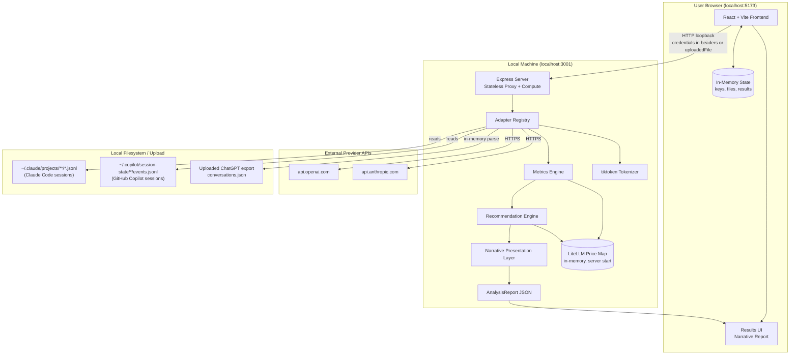
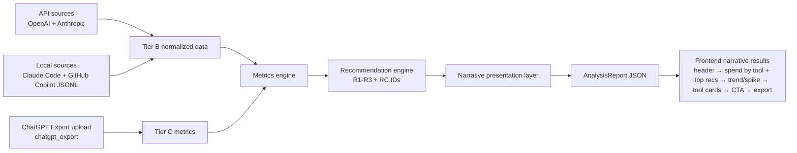
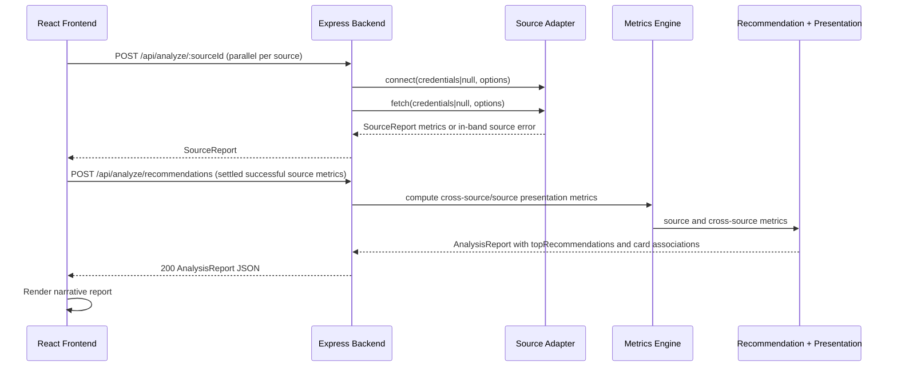
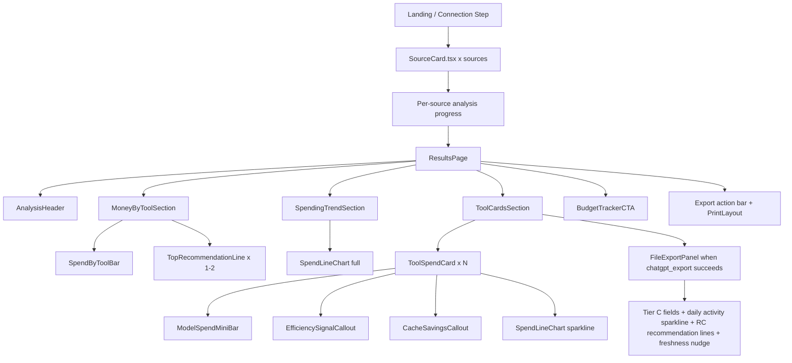
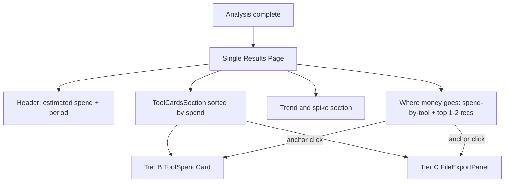

# Promptly Engineering Design v2.0

**Version:** 2.0
**Date:** 2026-07-04
**Author:** architect agent
**Source spec:** spec.md v2.2 (2026-07-04)
**Status:** Canonical (current)

---

## Table of Contents

1. System Architecture
2. Project Structure
3. Backend Design (Node + Express)
4. Frontend Design (React + Vite)
5. Data Models (TypeScript Interfaces)
6. Architectural Decisions (ADRs)
7. Build and Run
8. Deferred Items and Implementation Choices
9. Resolved Spec Decisions
10. Design Review Handoff
11. Changelog

---

## 1. System Architecture

ED v2.0 adds a backend presentation layer between raw metrics/recommendation evaluation and the React results page. Adapters still normalize source data and the metrics engine still computes source-level and cross-source metrics, but the response contract now includes narrative-ready fields: estimated spend, effective cost per million tokens, spend by tool, explicit trend status, spike callout data, dominant model, efficiency signal, average session cost availability, cache savings availability, and contextual recommendation placement metadata. The frontend renders these fields in an analyst-report flow rather than reconstructing business meaning from raw token diagnostics.

### 1.1 Component Diagram



The presentation layer owns cross-source spend-by-tool, trend status, spike callout, top recommendation slots, per-tool narrative fields, and export-ready shape.

### 1.2 Data Flow per Source



API sources OpenAI and Anthropic validate/fetch via provider APIs. Local sources Claude Code and GitHub Copilot validate/fetch by reading local JSONL files. Those four sources normalize to Tier B `NormalizedSourceData`. ChatGPT Export (`chatgpt_export`) is an active Tier C MVP source. Additional Tier C sources (e.g., `claude_export`) are deferred to P1. `chatgpt_export` accepts a user-uploaded export and normalizes to Tier C metrics. Metrics engine computes source metrics and cross-source metrics. Recommendation engine evaluates R1–R3 and applicable Tier C RC recommendations. Presentation layer computes `spendBySource`, `topRecommendations`, trend/spike fields, and per-tool card fields. Frontend renders the narrative results page.

### 1.3 Request/Response Lifecycle for a Full Analysis



The frontend sends one analysis request per connected source, in parallel, so per-source progress indicators can update independently. Each source response returns normalized metrics or an in-band error for that source. After all source requests settle, the frontend submits the combined successful source metrics to the recommendation endpoint. The backend recommendation/presentation pass returns cross-source summary fields, top recommendation placement, and per-tool recommendation associations. The frontend then renders the narrative report. R4 is not evaluated.

### 1.4 Stateless Server Pattern

The server remains stateless and local. It does not persist API keys, uploaded file content, normalized source data, or analysis reports. Credentials are supplied per request and are not logged. Uploaded ChatGPT export content is parsed in memory and is not written to disk.

---

## 2. Project Structure

The active MVP project structure keeps the source/adapter split and replaces the old dashboard/source-panel results tree with narrative report components.

```text
client/src/components/
  SourceCard.tsx                 # shared source connection card; renders chatgpt_export as an active live source, not a dedicated stub
  Results/
    ResultsPage.tsx              # orchestrates the report
    AnalysisHeader.tsx
    MoneyByToolSection.tsx
    TopRecommendationLine.tsx
    SpendingTrendSection.tsx
    ToolCardsSection.tsx
    ToolSpendCard.tsx            # Tier B uniform source-card implementation
    FileExportPanel.tsx          # Tier C uniform card implementation for chatgpt_export
    ModelSpendMiniBar.tsx
    EfficiencySignalCallout.tsx
    CacheSavingsCallout.tsx
    BudgetTrackerCTA.tsx
    charts/SpendByToolBar.tsx
    charts/SpendLineChart.tsx    # or renamed/repurposed DailySpendLine.tsx
server/src/adapters/
  openai.ts
  anthropic.ts
  githubCopilot.ts
  claudeCode.ts
  chatgptExport.ts              # active Tier C MVP adapter
  claudeExport.ts               # deferred P1 additional Tier C source
```

`FileExportPanel.tsx` is the active Tier C results panel for `chatgpt_export`. It is no longer a P1-deferred panel and must not be deleted. The component renders the Tier C implementation of the uniform source-card model. It uses the same card container, ordering, expansion behavior, and visual density as Tier B `ToolSpendCard` entries, but its fields are Tier C-specific.

`FileExportPanel.tsx` renders:

- conversation count
- message count and/or average conversation length in turns
- model mix by conversation count
- estimated relative cost labeled `estimated from conversation count` or `estimated from conversation activity`
- daily activity sparkline using conversation count by day
- triggered Tier C recommendation lines (`RC1`, `RC3`, `RC4a`, `RC4b`, `RC5`, `RC6`)
- data-freshness nudge telling the user to re-export ChatGPT data when stale

`FileExportPanel.tsx` participates in the spec §7 uniform card model. It is the Tier C card implementation that renders inline with Tier B cards in the narrative results page.

Remove from the active MVP tree: `SourcePanel.tsx`, per-source result panels (`OpenAIPanel`, `AnthropicPanel`, `CopilotPanel`, old `ClaudeCodePanel` if present), `ModelCostSharePie.tsx`, `ConversationLengthBar.tsx`, and raw `TokenRatioBar.tsx` as primary result UI.

Do not add or reference a dedicated ChatGPT export source-card component. `chatgpt_export` uses the shared `SourceCard.tsx` component for the connection card and `FileExportPanel.tsx` for the results card.

---

## 3. Backend Design (Node + Express)

Backend design remains stateless and adapter-based. ED v2.0 changes the response contract: the backend now produces narrative-ready presentation metrics and recommendation placement metadata in addition to raw/source diagnostics. The design must not describe source-panel-specific server behavior.

### 3.1 API Routes

#### `GET /api/health`

Health endpoint for local development and diagnostics.

#### `GET /api/price-map/meta`

Returns LiteLLM price-map metadata and fallback/fetched status so export caveats can include the price map date/source.

#### `POST /api/sources/:sourceId/validate`

Optional lightweight validation/probe endpoint for source connection cards. File-upload sources pass `credentials = null` and an uploaded file option; API-key sources pass masked/ephemeral credentials in headers.

#### `POST /api/analyze/:sourceId`

`POST /api/analyze/:sourceId` analyzes one connected source and returns that source's `SourceReport` with metrics or an in-band error. `:sourceId` is one of `claude_code | openai | anthropic | github_copilot | chatgpt_export`. API-key sources pass credentials in headers; local/no-credential sources pass no credential. `chatgpt_export` passes the uploaded ChatGPT export file through `uploadedFile` and returns Tier C metrics. ChatGPT Export (`chatgpt_export`) is an active Tier C MVP source. Additional Tier C sources (e.g., `claude_export`) are deferred to P1. The route accepts date-range/options relevant to that source and returns per-source progress/results independently.

#### `POST /api/analyze/recommendations`

`POST /api/analyze/recommendations` accepts the settled successful source metrics and returns the complete `AnalysisReport`: `sources[]`, `crossSourceSummary`, `recommendations`, `topRecommendations`, and export metadata. It evaluates R1–R3 plus applicable Tier C recommendation IDs and computes the narrative presentation fields used by the Results page and exports.

Request-level failures may return non-2xx. Per-source failures are represented in the corresponding `SourceReport.error` and do not prevent other source reports from rendering. If zero sources succeed, the frontend returns to the connection step with source errors.

### 3.2 Source Adapter Interface

```typescript
export type SourceId =
  | 'claude_code'
  | 'openai'
  | 'anthropic'
  | 'github_copilot'
  | 'chatgpt_export';

export type AdapterCredentials =
  | { apiKey: string }
  | { token: string }
  | null;

export interface AdapterConnectOptions {
  startDate?: Date;
  endDate?: Date;
  /** Browser boundary uses File; server boundary may receive Buffer after multipart parsing. */
  uploadedFile?: File | Buffer | null;
  priceMap: PriceMap;
  tokenizer?: Tokenizer;
  abortSignal?: AbortSignal;
}

export interface AdapterConnectionResult {
  success: boolean;
  error: AdapterError | null;
  tier: 'B' | 'C' | null;
}

export interface SourceAdapter {
  id: SourceId;

  /** Lightweight source probe. File-upload sources pass credentials=null and options.uploadedFile. */
  connect(
    credentials: AdapterCredentials,
    options: AdapterConnectOptions
  ): Promise<AdapterConnectionResult>;

  /** Full fetch/parse + normalization. Always resolves; errors are in the result. */
  fetch(
    credentials: AdapterCredentials,
    options: AdapterConnectOptions
  ): Promise<AdapterResult>;

  normalize(rawData: unknown): NormalizedSourceData;
}
```

API-key sources pass credentials and no `uploadedFile`. Local no-credential sources pass `credentials = null`. `chatgpt_export` also passes `credentials = null`, with `options.uploadedFile` populated from the user-selected ChatGPT export upload. The adapter reads the file in memory and returns Tier C data. No file-upload source writes uploaded content to disk.

Adding a new provider requires adapter + registry + source card + any required narrative-presentation mapping. `chatgpt_export` uses the shared `SourceCard.tsx` component for its connection card, not a dedicated stub. Metrics/recommendation changes are only needed if the provider introduces new metric shapes or recommendation rules.

### 3.3 Concrete Adapter Designs

#### 3.3.1 `openai.ts`

OpenAI emits Tier B daily tokens/costs. `cached_input_tokens` is a subset of `input_tokens` and is never added to token totals. Source cost is displayed as Estimated spend. Per-model cost share is price-weighted from token counts and LiteLLM prices, not directly returned by the Costs API, and is labeled as an estimated model cost breakdown.

#### 3.3.2 `anthropic.ts`

Anthropic input-token totals treat `input_tokens`, `cache_creation_input_tokens`, and `cache_read_input_tokens` as additive buckets for token totals, input/output ratio, and R1/R3 calculations. Source cost is displayed as Estimated spend; per-model cost share includes cache creation/read prices where available.

#### 3.3.3 `githubCopilot.ts`

Copilot cost is derived from `requests.cost` in `modelMetrics`, summed across qualifying sessions and models. `usage.inputTokens` is the total prompt token count; `cacheReadTokens` and `cacheWriteTokens` are subsets and are not added to token totals. Copilot supports dominant model, model spend breakdown, efficiency signal, average session cost, R2, and R3. Copilot cache savings dollars are unavailable/deferred because `requests.cost` is provider-computed and already inclusive of caching.

#### 3.3.4 `chatgptExport.ts`

`chatgpt_export` is an active Tier C source adapter. It accepts no credentials and receives a user-uploaded ChatGPT data export file. The upload path reads `conversations.json` from the ChatGPT export ZIP in memory; if the frontend normalizes the upload to the extracted JSON file, the adapter treats that extracted `conversations.json` as the same source payload. Promptly does not call a ChatGPT usage or billing API.

The adapter parses conversation records, message nodes, timestamps, model identifiers where present, and structural metadata only. It extracts the conversation list, per-conversation model ID when available, turn/message counts, tool invocation metadata when present (`code interpreter`, browsing, DALL-E), and create/update timestamps. It does not surface, semantically analyze, log, or export prompt/response text.

The adapter computes Tier C metrics for spec v2.2 §§7.19–7.25:

- `conversation_count`
- `message_count`
- `avg_conversation_length_turns`
- `model_mix: Record<string, number>` where key = model ID or `unknown`, value = conversation count
- `daily_activity: { date: string; conversation_count: number }[]`
- `estimated_token_volume`, derived from the conversation-length heuristic
- `estimated_relative_cost_usd`, derived from estimated token volume and LiteLLM model prices where available
- Tier C `trend` and `spike_callout`, based on daily conversation activity rather than spend

Tier output is `C`. The source contributes `estimated_relative_cost_usd` to the cross-source estimated spend total and spend-by-tool ordering, but never to actual billing spend. The adapter `connect()` call accepts `null` credentials plus an `uploadedFile` option for file-upload sources, per §11.

#### 3.3.5 `claudeCode.ts`

`claudeCodePeakHourFraction` remains an adapter-computed diagnostic field only. It may be retained in internal diagnostics/export caveats if useful, but no MVP recommendation consumes it because R4 is removed from scope. Do not mention R4 behavior here.

`claudeCodePeakHourFraction` is optional diagnostic telemetry, not a recommendation trigger.

### 3.4 Tier Classification Engine

Claude Code, OpenAI, Anthropic, and GitHub Copilot emit Tier B when successful. ChatGPT Export (`chatgpt_export`) is an active Tier C MVP source. Additional Tier C sources (e.g., `claude_export`) are deferred to P1. Tier A remains an architectural/future concept only. A failed adapter returns `tier: null` with an error. A successfully connected Tier B source with zero usage in the selected period remains connected and renders the zero-usage message rather than being treated as Tier C.

### 3.5 Insight Computation Module

1. **Cross-source summary metrics**
   - Total estimated spend: primary display label, summing connected Tier B sources plus active Tier C `chatgpt_export` estimated relative cost.
   - Total tokens: provider-aware token sum.
   - Blended/effective rate: internal `blendedRatePer1MTokens`; export `effective_cost_per_million_tokens_usd`.
   - Cross-source daily spend roll-up: export `daily_spend[]`.
   - Spend by source/tool: internal `spendBySource`; export `spend_by_tool[]`, sorted descending.
   - Trend status: internal `trendStatus` + `trendMoMPercent`; export `trend{status,mom_change_pct,observed_days,required_days,message}`. Status is always present and never silently hidden.
   - Spike detection: triggered when peak daily spend is at least 2× average and at least 3 days of data exist; export `spike_callout{date,spend_usd,multiple_of_average,message}`.
   - Top recommendations: internal `topRecommendations`, max 2, savings-bearing, sorted by estimated dollars desc with severity tie-break.

2. **Per-source/tool metrics**
   - Estimated spend for the tool.
   - Dominant model: internal `dominantModel`; export `primary_model` / model spend breakdown as canonical snake_case.
   - Model spend breakdown: horizontal bar data, sorted by source spend share.
   - Efficiency signal: internal `efficiencySignal`; export `efficiency_signal{kind,headline,explanation,input_output_ratio}`.
   - Average session cost: internal `avgSessionCostUsd`; export `avg_session_cost_usd`; null/unavailable note for OpenAI/Anthropic.
   - Cache savings: dollars for Anthropic and Claude Code when computable; unavailable for Copilot; OpenAI not actionable as a display savings callout.
   - Source trend/spike fields as needed for tool cards/export: `spikeDetected`, `spikeRatio`, `spikePeakDate`.
   - Source-scoped `recommendations` for per-tool cards.

3. **Raw diagnostics retained for export/supporting data**
   - Provider-aware token totals, raw input/output ratios, daily spend arrays, model token breakdowns, Copilot request/reasoning fields, session counts, average tokens/session, and `claudeCodePeakHourFraction` as diagnostic only.

Do not include TypeScript function bodies in this section. Function names may be referenced only as design labels.

#### Cross-Source Aggregation Note — `totalTokens()`

Token aggregation must use spec §7.2 provider-aware formulas: OpenAI uses `input + output`; Anthropic and Claude Code add standard input + cache creation + cache read + output; GitHub Copilot uses `usage.inputTokens + usage.outputTokens` and does not add cache read/write or reasoning tokens. The cross-source token total feeds the header token sub-line and effective cost/blended rate.

#### `computeCopilotTierBMetrics()` — Additional Computed Fields

Copilot source metrics must include daily spend, model spend breakdown from `requests.cost`, aggregate input/output ratio, daily input token series for R3, session count, average tokens/session as a diagnostic, average session cost for the tool card, and request/reasoning breakdown for JSON/supporting data. The Results page prioritizes estimated spend, dominant model, efficiency signal, average session cost, daily spend sparkline, and per-tool recommendations.

#### `computeTierBMetrics()` — Projected R1 Savings

Tier B metrics for Anthropic and Claude Code must expose forward-looking projected R1 savings using spec §8 R1. This is distinct from realized cache savings in §7.8. R1 recommendation cards use projected savings; cache savings callouts use realized savings.

### 3.6 Recommendation Engine

Active recommendation IDs are `R1`, `R2`, `R3`, `RC1`, `RC3`, `RC4a`, `RC4b`, `RC5`, and `RC6`. R4, RC2, and RC7 are removed/omitted and must not be emitted, displayed, or exported. Recommendations are generated per rule after metrics are computed, linked to one or more source IDs, and carry display metadata for progressive disclosure: compact/top-slot summary when savings-bearing, full per-tool explanation, triggering metric summary, and estimated savings where computable. The engine may maintain severity ordering for general lists; top money-saving slots are sorted by estimated dollar saving descending, ties by severity.

Rule trigger and output mapping:

- R1 Prompt Caching: triggers unchanged for Anthropic and Claude Code. Produces one source-scoped card per triggering source. Savings uses projected R1 formula.
- R2 Model Downgrade: all Tier B sources. Trigger uses `model_cost_share(premium) > 0.3`, `output_tokens_per_day(premium) < 500`, and `total_spend_premium_model_usd > $5`; card suppressed unless `[Z]` and `[Y]` are computable.
- R3 Reduce Prompt Verbosity: evaluated per source. Each Tier B source that individually has p90 daily input > 50,000 and input/output ratio > 8 receives its own card, with approximate savings when input rates are available.
- R4: removed from scope; no row.

#### R1 trigger implementation (`R1_promptCaching.ts`)

R1 evaluates Anthropic paths A/B as one Anthropic trigger and Claude Code path C as a separate trigger. If both sources trigger, emit two separate recommendations. Each card resolves `[source_name]` independently and uses projected R1 savings from the triggering source. R1 is not actionable for OpenAI or GitHub Copilot.

#### R1 `buildR1Card()` — Savings Computation

R1 card savings must come from the forward-looking projected savings formula, not realized cache savings. If no models have required cache price fields, omit the savings phrase for that card.

#### R2 downgrade-candidate tables (`R2_modelDowngrade.ts`)

For OpenAI/Anthropic, use the spec table: `gpt-4o → gpt-4o-mini`, `gpt-4-turbo → gpt-4o-mini`, `claude-3-5-sonnet-* → claude-3-haiku-*`, `claude-3-opus-* → claude-3-5-sonnet-*`. For Copilot, use prefix matching from spec §8: `claude-opus-4.5/4.6/4.7/4.8 → claude-haiku-4.5`, `claude-sonnet-4* → claude-haiku-4.5`, `gpt-5.4/gpt-5.5 → gpt-5.4-mini`, `gemini-3.1-pro → gemini-3.5-flash`, `claude-fable-5 → claude-haiku-4.5`.

R2 savings formula: `[Z] = current_spend_for_source × model_cost_share(premium_model) × (1 − cheaper_model_price / premium_model_price)`. `[Y]` is the same factor expressed as a percentage of source spend. Both prices use blended `(input + output) / 2` LiteLLM prices. Suppress the card if the cheaper price is missing.

#### R3 Copilot Coverage (`R3_verbosity.ts`)

R3 applies to all Tier B sources, including GitHub Copilot, but it is evaluated per source rather than on an aggregate across sources. For each source, compute daily input token series using provider-aware formulas and trigger only when that source's p90 daily input exceeds 50,000 and that source's input/output ratio exceeds 8. Each triggering source gets its own per-tool recommendation card. Top-slot eligibility uses the source's approximate savings and follows global top-slot sorting.

R4 Off-Peak Hours is removed from MVP recommendation output because it is latency/throughput oriented and has no measurable cost impact. Former peak-hour diagnostics may remain internal but do not produce recommendations.

### 3.7 LiteLLM Price Map Integration

Keep fetched + bundled fallback price-map architecture. ED v2.0 uses LiteLLM fields for model cost share, effective/blended rate, R1 projected savings, R2 savings, R3 approximate savings, and Claude Code cost computation. Include `cache_creation_input_token_cost` alongside input/output/cache-read prices. Chart terminology should reference horizontal model spend bars, not pie charts.

### 3.8 Error Handling and Timeout Policy

Each per-source analyze request has source-level timeout behavior. The frontend waits for all source requests to settle before requesting recommendations/presentation metrics. A source timeout returns an in-band source error; it does not block other sources. The recommendation pass should handle an empty successful-source set by returning/allowing the frontend zero-success state.

### 3.9 Key and Credential Handling

Credentials remain header-only, ephemeral, and unlogged. API keys and tokens are never persisted. Uploaded file content remains memory-only.

---

## 4. Frontend Design (React + Vite)

ED v2.0 frontend renders a narrative analyst-report flow: header → spend by tool + top recommendations → daily trend + spike/trend note → expandable per-tool cards → budget tracker CTA → export. It does not render source panels or a standalone global recommendations section.

### 4.1 Page / Component Hierarchy



The narrative results page uses one uniform card model for all connected successful sources. The card container, sort order, expansion behavior, source title area, recommendation placement, and visual rhythm are shared across tiers. The card body renders conditionally from the source's data tier and metric availability.

Tier B cards use `ToolSpendCard` and render actual/computed spend fields: estimated spend label, dominant model sentence, horizontal model spend bars, efficiency signal, cache savings where computable, average session cost where available, daily spend sparkline, and source-scoped R1–R3 recommendations.

Tier C `chatgpt_export` uses `FileExportPanel` as the Tier C card implementation. It follows the same card container/layout as Tier B `ToolSpendCard` entries and appears inline in `ToolCardsSection`, sorted by the same spend ordering. Its spend value is `estimated_relative_cost_usd`, visually flagged with copy such as `estimated from conversation count` or `estimated from conversation activity`.

Fields unavailable for Tier C are absent or rendered as `N/A — not available for file export sources`. This applies to actual billing spend, dominant model cost share, input/output efficiency signal, cache savings, and average session cost. Tier C replaces those fields with conversation count, message count, average conversation length, model mix by conversation count, daily activity sparkline, freshness nudge, and Tier C recommendations.

The spend-by-tool bar and card sorting handle mixed actual/computed Tier B values and estimated Tier C values. Tier C estimate markers must remain visible in both the top spend breakdown and the card.

### 4.2 State Management

State tracks Tier B sources plus active `chatgpt_export`, per-source status/progress/error, uploaded ChatGPT export file reference while in memory, per-source `SourceReport` results, final `AnalysisReport`, and local accordion expansion state. API keys, uploaded file content, and analysis results remain memory-only. ChatGPT Export (`chatgpt_export`) is an active Tier C MVP source. Additional Tier C sources (e.g., `claude_export`) are deferred to P1.

### 4.3 Onboarding (Source Connection) Flow

Landing renders source connection cards through shared `SourceCard.tsx`: Claude Code, OpenAI, Anthropic, GitHub Copilot, and active ChatGPT Export (`chatgpt_export`). `chatgpt_export` uses the shared `SourceCard.tsx` component, not a dedicated stub, and presents the upload affordance for the ChatGPT export file. Claude Code and GitHub Copilot have no credential inputs and validate by filesystem probe. OpenAI/Anthropic include masked admin-key inputs and date range. When only local/no-credential sources are enabled, show a global date range picker for those sources. When API sources are configured, local/no-credential sources use the union of API date ranges. Additional Tier C sources (e.g., `claude_export`) are deferred to P1.

### 4.4 Analysis Loading State

Analysis shows per-source progress indicators as each `POST /api/analyze/:sourceId` request resolves. Final narrative results render only after all source requests settle and the recommendation/presentation pass completes. If zero sources succeed, return to the connection step with source errors.

### 4.5 Results View

ResultsPage composition, top-to-bottom:

1. `AnalysisHeader`: Estimated spend, analysis period always visible, token sub-line with blended/effective cost per million tokens, and trend badge/note with one of `available`, `insufficient_data`, `no_prior_spend`.
2. `MoneyByToolSection`: spend-by-tool horizontal bars sorted by estimated spend; top 1–2 money-saving recommendations with compact headline and dollar saving. Clicking a top recommendation scrolls to and expands the relevant tool card. Mixed Tier B actual/computed values and Tier C estimates keep estimate markers visible.
3. `SpendingTrendSection`: cross-source daily estimated spend line chart; spike callout when `peak ≥ 2× average` and at least 3 days of data; insufficient-data/no-prior-spend notes when applicable.
4. `ToolCardsSection`: one expandable card per connected successful source, sorted by estimated spend descending; highest-spend tool expanded by default. Tier B entries render `ToolSpendCard`. Tier C `chatgpt_export` renders `FileExportPanel` inline using the same card container/layout. Expanded Tier B cards show dominant model sentence/model mini-bars, efficiency signal, cache savings or unavailable note, average session cost or provider-unavailable note, daily spend sparkline, and full source-scoped recommendations. Expanded Tier C cards show conversation count, message count, average conversation length, model mix by conversation count, estimated relative cost with estimate label, daily activity sparkline, freshness nudge, and triggered RC recommendation lines. Overflow recommendations appear in cards only.
5. `BudgetTrackerCTA`: placeholder only; no budget-setting/tracking logic.
6. Export actions: PDF and JSON.

Failed source pills/diagnostics may appear in a small status row, but they do not recreate source panels.

### 4.6 Charts

Required chart/visual patterns: horizontal spend-by-tool bars, cross-source spend trend line chart, per-tool daily spend sparkline, and horizontal model spend mini-bars. Raw token-ratio charts and pie/donut model cost shares are not primary Results UI. Any diagnostic token tables belong in export/supporting details, not the main narrative page.

### 4.7 Export Trigger

#### PDF

PDF is generated client-side and mirrors the narrative analysis page: Page 1 includes header, spend breakdown, top money-saving recommendations, trend badge/note, trend chart, and spike callout. Page 2+ includes per-tool cards sorted by estimated spend with full recommendations in context. Assumptions/caveats include per-source accuracy notes, LiteLLM price map date, and the standard estimated-spend disclaimer. Top-slot recommendations are not interactive in PDF; the full text is reproduced in the relevant per-tool section. All spend labels use `Estimated spend`.

#### JSON

JSON export serializes the canonical spec §10 shape with snake_case field names. Retain `total_actual_spend_usd` for backwards compatibility while adding `total_estimated_spend_usd`, `effective_cost_per_million_tokens_usd`, `daily_spend`, `spend_by_tool`, `trend`, and `spike_callout`. Per-source metrics add canonical snake_case equivalents for estimated spend, model spend breakdown, primary/dominant model, average session cost, efficiency signal, cache savings, daily spend sparkline/series, and active Tier C ChatGPT Export metrics. Recommendation IDs are `R1 | R2 | R3 | RC1 | RC3 | RC4a | RC4b | RC5 | RC6`; RC2 and RC7 are intentionally omitted.

### 4.8 No Auth, No Routing Complexity

No authentication, accounts, or persistence are introduced. The frontend may remain phase-based for MVP, but the design should not treat absence of routing as a one-way door. If routes are added, they should be shallow client routes for landing/analyzing/results only and must not imply server-side session persistence.

---

## 5. Data Models (TypeScript Interfaces)

These interfaces are the contract between adapters, metrics, presentation layer, client rendering, and JSON export. Internal/client-server fields may use camelCase; JSON export uses canonical snake_case from spec §10. ED should list interface shapes and field contracts, not implementation code.

### SourceId / AnalysisRequest

```typescript
export type SourceId =
  | 'claude_code'
  | 'openai'
  | 'anthropic'
  | 'github_copilot'
  | 'chatgpt_export';
```

Keep non-`SourceId` `AnalysisRequest` file-upload details aligned to Amendment 3 and Amendment 6: `chatgpt_export` uses `credentials = null` and `uploadedFile`; additional Tier C sources (e.g., `claude_export`) are deferred to P1.

### Normalized data and SourceMetrics

**Always / common fields:** `sourceId`, `tier`, `periodStart`, `periodEnd`, `warnings`, `estimatedSpendUsd`, `totalActualTokens`, `dailySpend`, `dominantModel`, `modelSpendBreakdown`, `efficiencySignal`, `avgSessionCostUsd`, `avgSessionCostUnavailableReason`, `spikeDetected`, `spikeRatio`, `spikePeakDate`, `recommendations`.

**Raw/supporting fields retained:** `modelBreakdown`, `aggregateInputOutputRatio`, provider-specific cache fractions and realized cache savings, average daily spend, peak day, rolling average, MoM value, session counts, average tokens/session, Copilot token/request/reasoning breakdown, `copilotDailyInputTokens`, and `claudeCodePeakHourFraction` as diagnostic only.

**Tier C ChatGPT Export metrics addition:**

```typescript
export interface TierCChatGptExportMetrics {
  estimated_token_volume: number;
  estimated_relative_cost_usd: number;
  total_conversations: number;
  total_messages: number;
  active_days: number;
  models_identified: string[];
  daily_conversation_activity: { date: string; conversation_count: number }[];
  trend: TrendStatus;
  spike_callout: SpikeCallout | null;

  // Explicit Tier C absences. These are null/absent and rendered as N/A with reason.
  total_spend_usd?: null;
  cache_savings_usd?: null;
  session_cost_usd?: null;
  dominant_model?: null;
}
```

Do not add `analysis_period_days` here. It is a computed cross-source metadata field derived from `analysis_period_start` / `analysis_period_end`, not a Tier C metric.

### RecommendationResult

```typescript
export type RecommendationId =
  | 'R1'
  | 'R2'
  | 'R3'
  | 'RC1'
  | 'RC3'
  | 'RC4a'
  | 'RC4b'
  | 'RC5'
  | 'RC6';
```

`RecommendationResult` retains title/body/severity/source IDs/triggering metric/savings, and adds presentation fields: compact headline or short summary, trigger summary, top-slot eligibility, target source/card anchor, and savings label/caveat when approximate. R4 is removed and must not appear.

RC6 trigger note: `RC6` uses `models_identified: string[]`; trigger logic checks for a null/absent or empty list per spec §8, not a model-count record.

### CrossSourceSummary / AnalysisReport

Internal/client-server contract additions: `CrossSourceSummary` gains `blendedRatePer1MTokens`, `trendStatus`, `trendMoMPercent`, `spendBySource`, and `topRecommendations`. It should also carry cross-source daily spend and spike detection data, or map these into equivalent export fields. `AnalysisReport` retains all sources and recommendations but clearly separates all recommendations from top-slot recommendations.

Export contract: `cross_source_summary` retains `total_actual_spend_usd` for backwards compatibility and adds `total_estimated_spend_usd`, `total_actual_tokens`, `effective_cost_per_million_tokens_usd`, `daily_spend`, `spend_by_tool`, `trend`, and `spike_callout` using canonical snake_case.

`total_estimated_spend_usd` is the mixed estimated total used by the page header and spend-by-tool chart. It equals Tier B actual/computed spend contributions plus Tier C `estimated_relative_cost_usd` contributions. `total_actual_spend_usd` remains Tier B-only and is retained for backwards compatibility. If any Tier C value contributes to `total_estimated_spend_usd`, the UI/export marks the mixed total as including estimates from file export sources.

### JSON export schema example

Compact canonical cross-source example:

```json
{
  "cross_source_summary": {
    "total_actual_spend_usd": 123.45,
    "total_estimated_spend_usd": 137.25,
    "total_actual_tokens": 9000000,
    "effective_cost_per_million_tokens_usd": 15.25,
    "daily_spend": [{ "date": "2026-07-04", "spend_usd": 12.34 }],
    "spend_by_tool": [{ "source_id": "chatgpt_export", "estimated_spend_usd": 13.8, "estimate_label": "estimated from conversation activity" }],
    "trend": { "status": "available", "mom_change_pct": 12.3, "observed_days": 30, "required_days": 30, "message": "Spend is up." },
    "spike_callout": { "date": "2026-07-02", "spend_usd": 20.1, "multiple_of_average": 2.2, "message": "Spike detected." }
  }
}
```

Compact per-source example fields include `estimated_spend_usd`, `model_spend_breakdown`, `primary_model`, `avg_session_cost_usd` or unavailable note, `efficiency_signal`, `cache_savings`, and raw diagnostics where applicable. Keep `total_actual_spend_usd` in the cross-source example explicitly as backwards compatibility.

---

## 6. Architectural Decisions (ADRs)

### ADR-1: Stateless Local Express Server (not Pure Client-Side)

**Status:** Accepted

The server remains a stateless local proxy/compute layer. It protects provider credentials from the browser where appropriate, centralizes local filesystem reads, and does not retain source data.

### ADR-2: LiteLLM Price Map Reuse (with Fetched + Bundled Fallback)

**Status:** Accepted

The LiteLLM price map is reused for §7.6, §7.8, R1, R2, R3 approximate savings, effective/blended rates, and Claude Code cost computation. Required fields include input, output, cache-read, and `cache_creation_input_token_cost` where available.

### ADR-3: Export Formats (PDF + JSON, Both Client-Side)

**Status:** Accepted

Client-side export remains the MVP choice. PrintLayout mirrors the narrative analysis page, not the old summary/per-source/recommendations structure. JSON export must map internal camelCase to spec §10 snake_case and retain backwards-compatible `total_actual_spend_usd`.

### ADR-4: Adapter Pattern for Provider Extensibility

**Status:** Accepted

Adapters isolate source-specific validation, fetch/parse, normalization, and Tier B/Tier C shape differences. Recommendation rules may need source-specific data (for example, R1 only applies to Anthropic/Claude Code; Copilot has source-specific request/reasoning diagnostics). R4 is not part of MVP.

### ADR-5: TypeScript on Both Sides (over JavaScript)

**Status:** Accepted

TypeScript remains the shared implementation language for backend contracts, frontend state, and export models.

### ADR-6: Per-Source Failures Return 200 (Not 4xx/5xx)

**Status:** Accepted

Each per-source analyze request returns its own source report or request-level error. Source failures are in-band for that source and do not block other sources. The final report is built from settled source reports; if zero sources succeed, the frontend returns to the connection step instead of rendering results.

### ADR-7: Uniform Estimated Spend Label

**Status:** Accepted

**Context:** Source cost precision varies by provider/source, but the user needs one trustworthy money frame.

**Decision:** All user-facing spend totals use `Estimated spend`; README/export caveats document source-specific accuracy.

**Consequences:** UI copy is consistent, source accuracy is not hidden, and backwards-compatible JSON retains `total_actual_spend_usd`.

### ADR-8: Backend Presentation Metrics Layer

**Status:** Accepted

**Context:** The narrative page needs plain-language fields and consistent export semantics.

**Decision:** Compute trend status, spike callouts, spend-by-tool, top recommendations, dominant model, efficiency signal, cache savings availability, and average session cost availability in a backend presentation layer.

**Consequences:** UI components remain thin, export matches displayed meaning, and business semantics are testable centrally.

### ADR-9: Narrative Page Architecture — Single Scrollable Page

**Status:** Accepted

**Context:** The original ED described multiple views/tabs and per-source result panels. Spec v2.2 defines a single narrative scrollable page with progressive disclosure: top insight slot first, then per-source tool cards in spend order.

**Decision:** All source results render on a single page. No tabs. Progressive disclosure is handled by the top insight slot (max 2 recommendations) plus full tool cards below. Tier C cards render inline with Tier B cards, sorted by estimated/actual spend.

**Consequences:** Routing is simpler and no tab state management is required. The spend-sort logic must handle mixed actual/computed Tier B values and estimated Tier C values so ChatGPT Export can sort alongside API and local-session sources. Top-slot recommendation anchors scroll to the relevant tool card instead of switching tabs.



---

## 7. Build and Run

### 7.1 Prerequisites

- Node.js and npm compatible with the existing project.
- Local filesystem access to Claude Code and GitHub Copilot session JSONL paths when those local sources are selected.
- Optional provider admin/API credentials for OpenAI and Anthropic.
- A user-selected ChatGPT export file for active `chatgpt_export` Tier C analysis.

### 7.2 Install

```powershell
npm install
```

### 7.3 Run

```powershell
npm run dev
```

The Vite client and Express server run locally. Defaults remain suitable for clone-and-run development.

### 7.4 Environment Variables

```dotenv
# .env.example
# All variables are optional. Defaults match spec §11.

# Optional: override the LiteLLM price map URL for air-gapped installs
LITELLM_PRICE_MAP_URL=

# Optional: override the Claude Code data directory
CLAUDE_CONFIG_DIR=

# Optional local development ports
VITE_PORT=5173
EXPRESS_PORT=3001
```

No additional Tier C P1 file-export env vars are required for MVP. Active `chatgpt_export` uses the in-memory user upload path.

### 7.5 Dev vs Production

MVP remains local/development oriented. Production hardening can preserve the same stateless adapter and presentation-layer contracts.

---

## 8. Deferred Items and Implementation Choices

1. Chart styling details remain open within the chosen visual patterns: horizontal bars, line chart, sparklines.
2. PDF rendering library fallback remains a low-risk implementation choice: html2canvas + jsPDF or print stylesheet, as long as narrative structure is preserved.
3. Date range UI may use presets plus custom range; default remains last 30 days.
4. TypeScript sharing strategy remains an implementation choice.
5. Zero-usage successful sources must render the spec message; they are not blank panels and not errors.
6. All-sources-failed returns user to connection step.
7. Q5/Copilot cache savings dollars are deferred/unavailable; do not fabricate an estimate in ED v2.0.
8. Q6/FileExportPanel is decided: keep/update as the active Tier C result panel for `chatgpt_export`; no inactive P1 result panel. ChatGPT Export (`chatgpt_export`) is an active Tier C MVP source. Additional Tier C sources (e.g., `claude_export`) are deferred to P1.
9. Q7/PDF rendering library remains an implementation choice, but output structure is fixed by spec §10.
10. `claudeCodePeakHourFraction` remains diagnostic only; no R4 recommendation consumes it.

---

## 9. Resolved Spec Decisions

- OpenAI per-model cost: estimated via token/prices; label model breakdown as estimated.
- GitHub Copilot source: local JSONL only; no credentials; local-machine scope only.
- Total token formulas: provider-aware, with Copilot/OpenAI cache fields as subsets and Anthropic/Claude Code cache fields additive.
- R1: trigger unchanged; projected savings formula used.
- R2: savings formula `[Z] = current_spend_for_source × model_cost_share × (1 − cheaper/premium)`; suppress unpriced pairs.
- R3: per-source trigger; approximate savings allowed/labeled.
- R4: removed entirely; peak-hour fraction diagnostic only.
- Spike threshold: peak ≥ 2× average and ≥3 days.
- Trend status: always explicit (`available`, `insufficient_data`, `no_prior_spend`).
- FileExportPanel: active Tier C result panel for `chatgpt_export`; additional Tier C source panels (e.g., `claude_export`) are deferred to P1.
- JSON compatibility: retain `total_actual_spend_usd`, add new canonical snake_case fields.

---

## 10. Design Review Handoff

This ED v2.0 update is ready for design-review agent review for fidelity to spec v2.2, especially narrative page structure, v2 metric/type contracts, active `chatgpt_export` Tier C MVP behavior, R4 removal, R2/R3 formulas, `FileExportPanel.tsx` as the active Tier C results panel, shared `SourceCard.tsx` connection-card handling, Copilot cache savings unavailability, and canonical JSON export names.

Ready for design-review agent.

---

## 11. Changelog

See [engineering-design-changelog.md](./engineering-design-changelog.md).

*Ready for design-review agent.*

*End of Promptly Engineering Design v2.0*
